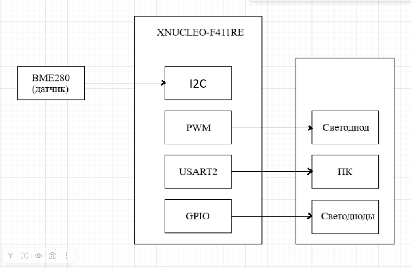
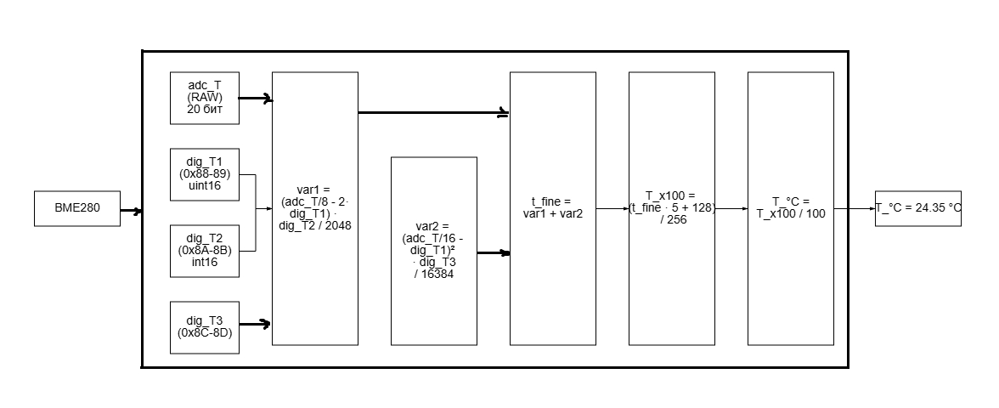
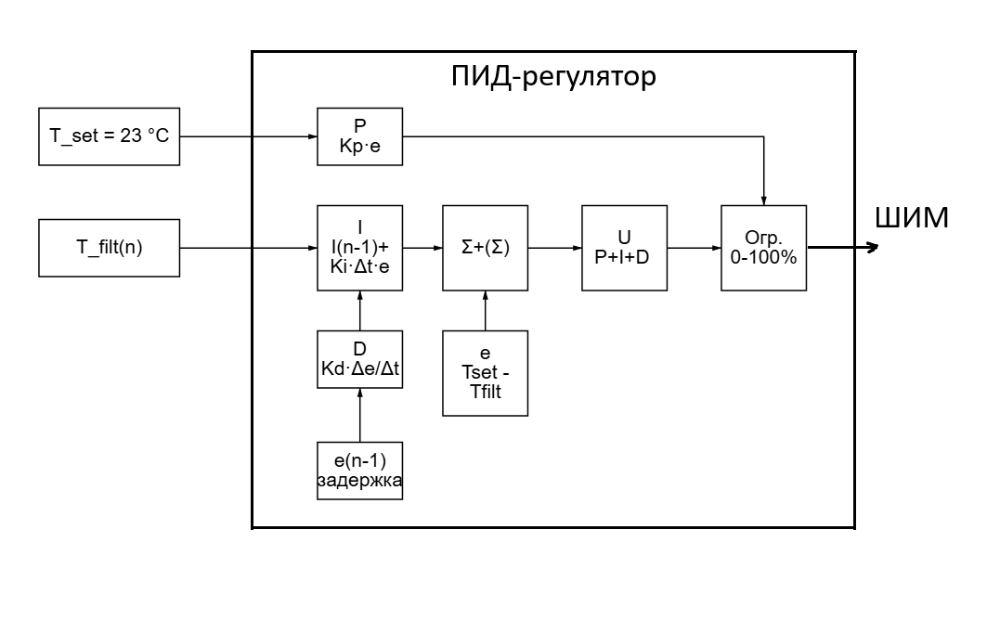
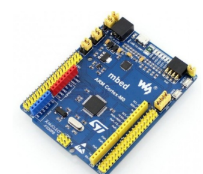
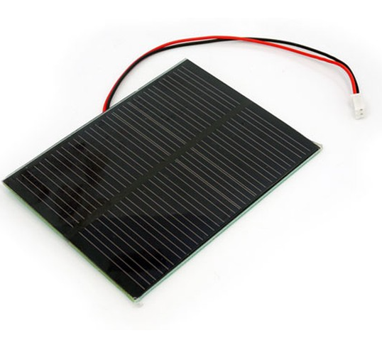
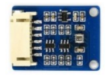

:imagesdir: .
:toc: macro
:toc-title: Содержание
:icons: font
:figure-caption: Рисунок
:table-caption: Таблица
:stem: latexmath
:source-highlighter: coderay

:toc: left

= Анализ требований к разработке устройства активной системы охлаждения

== Требования к разработке

[#Требования]
.Требования к разработке
[options="header", cols="1,3"]
|=====================
| Параметр | Требование
| Отладочная плата | XNUCLEO-F411RE (STM32F411RE)
| Питание | От солнечной батареи
| Датчик температуры | BME280
| Интерфейс с датчиком | I2C
| Период измерения и управления | 200 мс
| Заданная температура (Setpoint) | 23 °C
| Регулятор | ПИД (дискретный)
| Фильтр | Цифровой ФНЧ 1-го порядка
| Управление вентилятором | ШИМ (PWM), 0–100%
| Индикация скорости | 4 встроенных светодиода
| Вывод на ПК | USART2, период 500 мс
| Язык приложения | C++
| Компилятор | ARM 8.40.2
| ОС реального времени | FreeRTOS + C++ обертка
| Архитектура | UML (StarUML)
| Документация | Asciidoc, GitHub, ГОСТ
|=====================

[#Индикация скорости]
.Индикация скорости вентилятора светодиодами
[options="header", cols="2,2"]
|=====================
| Скорость, % | Количество горящих светодиодов
| < 20 | 0 (все выключены)
| 20 – 40 | 1
| 40 – 60 | 2
| 60 – 80 | 3
| 80 – 100 | 4
|=====================

== Общая схема устройства

[#Общая схема]
.Общая структурная схема устройства

**Принцип работы:**

- **Вход:** текущая температура окружающей среды (датчик BME280).
- **Управление:** ПИД-регулятор вычисляет ошибку между заданной (23 °C) и текущей температурой.
- **Выход:** требуемая скорость вращения вентилятора (0–100%).
- **Исполнение:** скорость преобразуется в скважность ШИМ, вентилятор изменяет обороты.
- **Индикация:** скорость отображается на светодиодах и через USART2 на ПК.

== Детальное описание блоков 

=== 1. Блок измерения температуры (BME280)

==== 1.1 Зачем нужен этот блок

Система должна знать текущую температуру, чтобы принимать решение: включать вентилятор или нет, и с какой скоростью. Без этого блока устройство будет «слепым» и не сможет ничего регулировать. Это самый первый блок во всей цепочке.

==== 1.2 Что делает

Измеряет температуру окружающей среды с высокой точностью (до 0.01 °C). Превращает физическую температуру в цифру, понятную микроконтроллеру.

==== 1.3 Вход и выход

*Вход:* отсутствует (измеряет внешнюю среду)

*Выход:* сырое цифровое значение температуры (RAW data), которое затем преобразуется в градусы Цельсия.

==== 1.4 Из чего состоит

- Датчик BME280 (маленькая плата с микросхемой)
- Интерфейс I2C (провода: питание, земля, линии данных SDA и тактовый сигнал SCL)
- Программный драйвер (библиотека, которая умеет общаться с датчиком)

==== 1.5 Какие пины и регистры задействованы

Согласно даташиту на отладочную плату XNUCLEO-F411RE и документации на STM32F411RE, для подключения BME280 по I2C используются следующие пины и регистры:

[options="header", cols="2,3,3,3"]
|=====================
| Сигнал | Пин на плате | Порт/пин MCU | Регистр настройки
| **VCC** | 3.3V | — | —
| **GND** | GND | — | —
| **SCL** | I2C SCL (PB8) | PB8 | GPIOB_MODER (альтернативный режим), GPIOB_AFRL (AF4 для I2C1)
| **SDA** | I2C SDA (PB9) | PB9 | GPIOB_MODER (альтернативный режим), GPIOB_AFRH (AF4 для I2C1)
|=====================

*Пояснение:* I2C1 расположен на пинах PB8 (SCL) и PB9 (SDA). Альтернативная функция AF4 включает I2C1 на этих пинах.

==== 1.6 Настройка датчика BME280

Перед началом работы с датчиком необходимо настроить GPIO для I2C, сам модуль I2C и выполнить инициализацию датчика.

===== Настройка GPIO для I2C

[options="header", cols="2,3,3,4"]
|=====================
| Регистр | Биты | Значение | Назначение
| `RCC->AHB1ENR` | `GPIOBEN` | 1 | Включение тактирования порта B
| `GPIOB->MODER` | `MODER8`, `MODER9` | 10 (альтернативный) | Настройка PB8(SCL) и PB9(SDA) под I2C
| `GPIOB->AFRL` | `AFRL8` | 0100 (AF4) | Привязка PB8 к I2C1 (SCL)
| `GPIOB->AFRH` | `AFRH9` | 0100 (AF4) | Привязка PB9 к I2C1 (SDA)
| `GPIOB->ODR` | `ODR8`, `ODR9` | 1 | Подтяжка линий к питанию через внешние резисторы
| `GPIOB->OTYPER` | `OT8`, `OT9` | 1 | Режим open-drain (требуется для I2C)
| `GPIOB->PUPDR` | `PUPDR8`, `PUPDR9` | 01 | Подтяжка вверх (pull-up)
|=====================

===== Настройка модуля I2C1

[options="header", cols="2,3,3,4"]
|=====================
| Регистр | Биты | Значение | Назначение
| `RCC->APB1ENR` | `I2C1EN` | 1 | Включение тактирования I2C1
| `I2C1->CR2` | `FREQ[5:0]` | 16 | Частота системы 16 МГц (для расчёта таймингов)
| `I2C1->CCR` | `CCR[11:0]` | 80 | Коэффициент для скорости 100 кГц (16 МГц / (2 × 100 кГц) = 80)
| `I2C1->TRISE` | `TRISE[5:0]` | 17 | Время нарастания (16 МГц × 1000 нс + 1 = 17)
| `I2C1->CR1` | `PE` | 1 | Включение I2C1
|=====================

===== Настройка датчика BME280

[options="header", cols="2,3,3,4"]
|=====================
| Действие | Регистр датчика | Значение | Назначение
| Сброс | `0xE0` | `0xB6` | Сброс датчика в исходное состояние
| Чтение | `0x88`…`0x8D` | — | Чтение калибровочных коэффициентов dig_T1, dig_T2, dig_T3
| Настройка | `0xF4` | `0x23` | Усреднение 4 измерения, нормальный режим
|=====================

==== 1.7 Как работает (по шагам)

Каждые 200 мс происходит следующее:

1. Микроконтроллер формирует START-условие на шине I2C.
2. Отправляет адрес датчика BME280 (0x76 или 0x77) с битом записи.
3. Отправляет команду на чтение регистров температуры (0xFA-0xFC).
4. Формирует повторный START и отправляет адрес с битом чтения.
5. Датчик возвращает 3 байта сырых данных через линию SDA.
6. Микроконтроллер формирует STOP-условие, завершая передачу.
7. Из 3 байт собирается 20-битное число.
8. По специальной формуле (с учетом калибровочных коэффициентов) число превращается в градусы Цельсия.

==== 1.8 Формула преобразования

Сырые данные преобразуются в температуру с использованием калибровочных коэффициентов (dig_T1, dig_T2, dig_T3), которые уникальны для каждого датчика:

RAW (сырые данные) — это 20-битное значение (0...1 048 575), которое датчик BME280 возвращает после измерения. Это не температура, а «цифровая проекция» сопротивления термометра, оцифрованная АЦП датчика.

Каждый датчик BME280 имеет индивидуальные калибровочные коэффициенты (dig_T1, dig_T2, dig_T3), записанные в его ПЗУ на заводе. Без них RAW невозможно перевести в градусы.

Более точная формула (из документации на BME280) использует коэффициенты, считанные из регистров датчика.

Пример: При dig_T1 = 27504, dig_T2 = 26435, dig_T3 = -1000 и RAW = 519888 получаем T = 24.35 °C.

==== 1.9 Математическая модель датчика

[#Общая схема]
.Модель BME280

===== Пояснение к математической модели

[#bme280-model-description]
.Пояснение математической модели BME280

Модель преобразует сырые данные с АЦП датчика (adc_T) в температуру в градусах Цельсия с использованием заводских калибровочных коэффициентов.

[options="header", cols="2,3,4"]
|=====================
| Параметр | Откуда берётся | Что означает
| `adc_T` (RAW) | Регистры `0xFA`-`0xFC` датчика | Сырое 20-битное значение с АЦП (0 … 1 048 575)
| `dig_T1` | Регистры `0x88`-`0x89` ПЗУ | Калибровочный коэффициент №1 (`uint16_t`)
| `dig_T2` | Регистры `0x8A`-`0x8B` ПЗУ | Калибровочный коэффициент №2 (`int16_t`)
| `dig_T3` | Регистры `0x8C`-`0x8D` ПЗУ | Калибровочный коэффициент №3 (`int16_t`)
|=====================

**Последовательность вычислений:**

[options="header", cols="1,3,3"]
|=====================
| Шаг | Формула | Назначение
| 1 | `var1 = (adc_T/8 - 2·dig_T1) · dig_T2 / 2048` | Линейная коррекция сырых данных
| 2 | `var2 = (adc_T/16 - dig_T1)² · dig_T3 / 16384` | Нелинейная (квадратичная) коррекция
| 3 | `t_fine = var1 + var2` | Промежуточное значение (используется также для давления и влажности)
| 4 | `T_x100 = (t_fine · 5 + 128) / 256` | Температура, умноженная на 100 (целое число)
| 5 | `T_°C = T_x100 / 100` | Преобразование в градусы Цельсия с плавающей точкой
|=====================

**Выход модели:**

- `T_°C` — температура в градусах Цельсия, например `24.35 °C`

**Ключевые особенности:**

- Калибровочные коэффициенты (`dig_T1`, `dig_T2`, `dig_T3`) **уникальны** для каждого экземпляра датчика и записаны на заводе
- Промежуточное значение `t_fine` сохраняется и используется для последующего расчёта давления и влажности (если требуется)
- Все вычисления выполняются в **целочисленной арифметике** для максимальной производительности на микроконтроллере
- Масштабирование `×100` позволяет работать с точностью `0.01 °C` без использования чисел с плавающей точкой
==== 1.10 Что получаем на выходе

Готовое значение температуры в градусах Цельсия, например: `24.35 °C`

Это значение передается дальше — в блок **цифрового фильтра** для очистки от шумов.

==== 1.11 Что может пойти не так и как это лечится

[options="header", cols="2,3,3"]
|=====================
| Проблема | Причина | Решение
| Нет данных от датчика | Неправильное подключение или не настроены пины | Проверить VCC, GND, SCL, SDA; проверить GPIOB_MODER
| Данные есть, но странные | Неправильная скорость I2C | Уменьшить частоту (например, 50 кГц)
| Температура скачет | Нет фильтра или шумы по питанию | Передать данные в блок цифрового фильтра; добавить конденсатор по питанию
|=====================

=== 2. Цифровой фильтр (ФНЧ 1-го порядка)

==== 2.1 Зачем нужен этот блок

Датчик BME280 выдает температуру с некоторыми шумами — значения могут скакать на 0.1-0.3 °C даже при стабильной среде. Если подать эти «грязные» данные прямо на ПИД-регулятор, он будет дергаться и неправильно управлять вентилятором. Фильтр сглаживает эти скачки, оставляя только реальное изменение температуры.

==== 2.2 Что делает

Сглаживает резкие скачки температуры, пропускает только медленные изменения (низкие частоты), а быстрые шумы отсекает. Это называется **фильтр нижних частот (ФНЧ)**.

==== 2.3 Вход и выход

*Вход:* сырое значение температуры от датчика stem:[T_{raw}(n)] (с шумами)

*Выход:* отфильтрованное значение температуры stem:[T_{filt}(n)] (сглаженное)

==== 2.4 Из чего состоит

Фильтр реализован программно — не требует дополнительного оборудования. Состоит из:
- Переменной для хранения предыдущего фильтрованного значения stem:[T_{filt}(n-1)]
- Коэффициента фильтрации stem:[\alpha]
- Периода дискретизации stem:[dt]

==== 2.5 Какие пины и регистры задействованы

Фильтр не требует аппаратных ресурсов — это чисто программный блок. Регистры и пины не задействуются.

==== 2.6 Как работает (по шагам)

Каждые 200 мс после получения нового сырого значения температуры:

1. Берем новое сырое значение stem:[T_{raw}] от датчика.
2. Берем предыдущее отфильтрованное значение stem:[T_{filt}(n-1)].
3. Считаем разницу: `difference = T_{raw} - T_{filt}(n-1)`
4. Умножаем разницу на коэффициент `alpha`.
5. Прибавляем результат к предыдущему фильтрованному значению.
6. Получаем новое фильтрованное значение.
7. Сохраняем его для следующего шага.

==== 2.7 Формула

[stem]
++++
T_{filt}(n) = T_{filt}(n-1) + \alpha \cdot (T_{raw}(n) - T_{filt}(n-1))
++++

где:
- stem:[T_{filt}(n)] — текущее отфильтрованное значение
- stem:[T_{filt}(n-1)] — предыдущее отфильтрованное значение
- stem:[T_{raw}(n)] — текущее сырое значение от датчика
- stem:[\alpha = 1 - e^{-dt / \tau}] — коэффициент фильтрации
- stem:[dt = 0.2] с — период дискретизации
- stem:[\tau = RC] — постоянная времени фильтра (чем больше, тем сильнее сглаживание)

==== 2.8 Пример работы фильтра

*Исходные данные:*

[stem]
++++
dt = 0.2,\quad \tau = 0.3,\quad \alpha = 0.4866
++++

*Шаг 1:* сырое значение 24.50, прошлое фильтрованное 24.30

[stem]
++++
T_{filt} = 24.30 + 0.4866 \cdot (24.50 - 24.30) = 24.30 + 0.0973 = 24.397
++++

*Шаг 2:* сырое значение 24.60, прошлое фильтрованное 24.397

[stem]
++++
T_{filt} = 24.397 + 0.4866 \cdot (24.60 - 24.397) = 24.397 + 0.0988 = 24.496
++++

Видно, что фильтр не пропускает резкие скачки, а плавно двигается за температурой.

==== 2.9 Как подобрать постоянную времени tau

[options="header", cols="2,3,3"]
|=====================
| Условия | Рекомендуемое tau | Эффект
| Очень шумный сигнал | 0.5 – 1.0 с | Сильное сглаживание, медленная реакция
| Умеренные шумы | 0.2 – 0.5 с | Среднее сглаживание, баланс
| Чистый сигнал | 0.05 – 0.2 с | Быстрая реакция, минимальное сглаживание
|=====================

Для данной системы рекомендуется начать с stem:[\tau = 0.3] с.

==== 2.10 Что получаем на выходе

Сглаженное значение температуры, например:

- Сырое: 24.35, 24.38, 24.52, 24.33, 24.41
- Фильтрованное: 24.35, 24.36, 24.42, 24.39, 24.40

Это значение передается дальше — в блок **ПИД-регулятора** для вычисления скорости вентилятора.

==== 2.11 Что может пойти не так

[options="header", cols="2,3,3"]
|=====================
| Проблема | Причина | Решение
| Фильтр слишком медленный | tau слишком большое | Уменьшить tau (например, 0.2)
| Фильтр почти не сглаживает | tau слишком маленькое | Увеличить tau (например, 0.5)
| Температура «плывет» после фильтра | Неправильный dt | Проверить, что фильтр вызывается строго каждые 200 мс
|=====================

=== 3. ПИД-регулятор

==== 3.1 Зачем нужен этот блок

Температура не стоит на месте — она меняется из-за работы оборудования, открытых окон, времени суток. Просто включать вентилятор на полную мощность при нагреве и выключать при охлаждении — плохое решение. Температура будет постоянно прыгать. ПИД-регулятор позволяет **плавно** и **точно** поддерживать заданную температуру (23 °C), автоматически подстраивая скорость вентилятора.

==== 3.2 Что делает

Вычисляет ошибку между заданной температурой (23 °C) и текущей отфильтрованной температурой. На основе этой ошибки рассчитывает, с какой скоростью должен крутиться вентилятор. Скорость получается плавной — без резких скачков.

==== 3.3 Вход и выход

*Вход:* отфильтрованная температура stem:[T_{filt}(n)] (от блока 2)

*Выход:* скорость вращения вентилятора stem:[Speed(n)] в процентах (0–100%)

==== 3.4 Из чего состоит

ПИД — это сумма трех независимых составляющих:

- **P** (пропорциональная) — реагирует на текущую ошибку
- **I** (интегральная) — накапливает ошибку со временем, убирает постоянное отклонение
- **D** (дифференциальная) — реагирует на скорость изменения ошибки, предотвращает перерегулирование

==== 3.5 Какие пины и регистры задействованы

ПИД-регулятор реализован программно — не требует дополнительных аппаратных ресурсов. Регистры и пины не задействуются.

== Математическая модель PID-регулятора

[#Математическая модель PID-регулятора]
.Математическая модель

==== 3.6 Как работает (по шагам)

Каждые 200 мс после получения отфильтрованной температуры:

1. Вычисляем ошибку: `error = 23.0 - T_filtered`
2. **Пропорция:** `P = Kp * error` (чем больше ошибка, тем сильнее воздействие)
3. **Интеграл:** `integral = integral + Ki * dt * error` (накапливаем ошибку)
4. **Дифференциал:** `D = Kd * (error - prevError) / dt` (смотрим, как быстро меняется ошибка)
5. **Скорость:** `speed = P + integral + D`
6. **Ограничение:** если speed < 0 → speed = 0; если speed > 100 → speed = 100
7. Запоминаем ошибку для следующего шага: `prevError = error`
8. Отдаем speed в блок ШИМ и на индикацию

==== 3.7 Формулы

ПИД-регулятор вычисляет скорость вращения вентилятора на основе ошибки между заданной и текущей температурой. Ниже приведены формулы всех составляющих.

*Ошибка регулирования:*

[stem]
++++
e(n) = T_{set} - T_{filt}(n)
++++

где:
- `e` — ошибка на текущем шаге (положительная — нужно охлаждать, отрицательная — перегрев)
- `T_set = 23` °C — заданная температура
- `T_filt` — текущая отфильтрованная температура

*Пропорциональная составляющая:*

[stem]
++++
P(n) = K_p \cdot e(n)
++++

где:
- `P` — пропорциональная часть (быстрая реакция на ошибку)
- `Kp = 4,0` — коэффициент усиления
- `e` — текущая ошибка

*Назначение:* чем больше ошибка, тем сильнее воздействие. Обеспечивает быстрый отклик на изменение температуры.

*Интегральная составляющая (с антинасыщением):*

[stem]
++++
I(n) = I(n-1) + K_i \cdot dt \cdot e(n)
++++

где:
- `I` — интегральная часть на текущем шаге
- `I_prev` — интегральная часть с предыдущего шага (накопленная история ошибок)
- `Ki = 0,5` — интегральный коэффициент
- `dt = 0,2` с — период дискретизации
- `e` — текущая ошибка

*Назначение:* накапливает ошибку со временем, устраняет постоянное отклонение (статическую ошибку), позволяя точно выйти на 23 °C.

*Ограничение интеграла (антинасыщение):* `I = max(-100, min(100, I))` — не даёт интегралу стать слишком большим.

*Дифференциальная составляющая:*

[stem]
++++
D(n) = K_d \cdot \frac{e(n) - e(n-1)}{dt}
++++

где:
- `D` — дифференциальная часть
- `Kd = 0,8` — дифференциальный коэффициент
- `e` — текущая ошибка
- `e_prev` — ошибка на предыдущем шаге
- `dt = 0,2` с — период дискретизации

*Назначение:* реагирует на скорость изменения ошибки. Если температура быстро растёт, дифференциальная часть увеличивает скорость вентилятора, предотвращая перегрев. Снижает колебания и перерегулирование.

*Итоговая скорость:*

[stem]
++++
u(n) = P(n) + I(n) + D(n)
++++

где `u` — управляющий сигнал до ограничения (может быть отрицательным или больше 100 %)

*Ограничение:*

[stem]
++++
Speed(n) = \max(0, \min(100, u(n)))
++++

где `Speed` — итоговая скорость вентилятора в процентах (0–100 %)

*Назначение ограничения:* вентилятор не может крутиться назад (отрицательная скорость) и не может превышать 100 % мощности. Ограничение приводит сигнал к допустимому диапазону.

==== 3.8 Подбор коэффициентов (метод Зиглера-Никольса)

Коэффициенты подбираются экспериментально на работающем устройстве.

**Шаги:**

1. Установить stem:[K_i = 0], stem:[K_d = 0]
2. Увеличивать stem:[K_p] до появления устойчивых колебаний температуры
3. Зафиксировать критический коэффициент stem:[K_{p,crit}] и период колебаний stem:[T_{crit}]
4. Рассчитать коэффициенты:

[stem]
++++
K_p = 0.6 \cdot K_{p,crit}
++++

[stem]
++++
K_i = \frac{2 \cdot K_p}{T_{crit}}
++++

[stem]
++++
K_d = \frac{K_p \cdot T_{crit}}{8}
++++

*Ориентировочные границы для тепловой системы:*

[options="header", cols="2,2,2"]
|=====================
| Коэффициент | Нижняя граница | Верхняя граница
| stem:[K_p] | 2.0 | 8.0
| stem:[K_i] | 0.1 | 1.5
| stem:[K_d] | 0.2 | 2.0
|=====================

==== 3.9 Пример расчета (цифровой)

*Исходные данные:*

[stem]
++++
K_p = 4.0,\quad K_i = 0.5,\quad K_d = 0.8,\quad dt = 0.2
++++

[stem]
++++
T_{filt} = 25.0\ ^\circ C
++++

[stem]
++++
e = 23.0 - 25.0 = -2.0
++++

[stem]
++++
e_{prev} = -1.0
++++

*Расчет:*

[stem]
++++
P = 4.0 \cdot (-2.0) = -8.0
++++

[stem]
++++
I = 0 + 0.5 \cdot 0.2 \cdot (-2.0) = -0.2
++++

[stem]
++++
D = 0.8 \cdot \frac{(-2.0) - (-1.0)}{0.2} = 0.8 \cdot \frac{-1.0}{0.2} = -4.0
++++

[stem]
++++
Speed = -8.0 - 0.2 - 4.0 = -12.2
++++

[stem]
++++
Speed = \max(0, -12.2) = 0\%
++++

*Вывод:* температура выше заданной (25°C > 23°C), ошибка отрицательная, скорость = 0%. Вентилятор не включается, потому что охлаждение не требуется.

При положительной ошибке (температура ниже 23°C) скорость будет положительной, и вентилятор начнет охлаждать.

==== 3.10 Что получаем на выходе

Значение скорости в процентах, например:
- 0% — вентилятор выключен
- 45% — вентилятор крутится на средних оборотах
- 100% — максимальная скорость

Это значение передается дальше — в блок **ШИМ** для формирования управляющего сигнала.

==== 3.11 Что дает каждая составляющая

[options="header", cols="2,2"]
|=====================
| Составляющая | Эффект
| stem:[P] | Быстрая реакция на изменение температуры
| stem:[I] | Убирает остаточную ошибку (точно держит 23 °C)
| stem:[D] | Снижает перерегулирование и колебания
|=====================

*Без ПИД:* вентилятор включается на 100% при нагреве, выключается при охлаждении → температура прыгает.

*С ПИД:* температура плавно выходит на 23 °C и стабильно держится.

==== 3.12 Что может пойти не так

[options="header", cols="2,3,3"]
|=====================
| Проблема | Причина | Решение
| Температура постоянно прыгает | Kp слишком большой | Уменьшить Kp
| Температура долго выходит на 23 °C | Kp слишком маленький | Увеличить Kp
| Остается ошибка (например, 22.5 °C) | Ki слишком маленький | Увеличить Ki
| Сильные колебания при стабильной температуре | Kd слишком большой | Уменьшить Kd
| Скорость уходит в 0 или 100 и не возвращается | Нет антинасыщения интеграла | Заморозить integral на пределах
|=====================

=== 4. ШИМ (PWM)

==== 4.1 Зачем нужен этот блок

ПИД-регулятор выдает скорость в процентах (0–100%). Но вентилятор не понимает процентов — он понимает только напряжение: либо есть (крутится), либо нет (стоит). Чтобы заставить вентилятор крутиться на половину мощности, нужно быстро включать и выключать питание много раз в секунду. Это называется **широтно-импульсная модуляция (ШИМ)**. Чем больше процент времени, когда напряжение есть, тем быстрее крутится вентилятор.

==== 4.2 Что делает

Преобразует цифровое значение скорости (0–100%) в электрический сигнал, который понимает вентилятор. Сигнал представляет собой прямоугольные импульсы: чем шире импульс, тем выше скорость.

==== 4.3 Вход и выход

*Вход:* скорость вращения stem:[Speed(n)] в процентах (от блока ПИД)

*Выход:* ШИМ-сигнал на пине микроконтроллера (подключается к вентилятору)

==== 4.4 Из чего состоит

- Таймер микроконтроллера (TIM2, TIM3, TIM4 или TIM5)
- Регистры настройки таймера (PSC, ARR, CCR)
- Выходной пин (GPIO в режиме альтернативной функции)

==== 4.5 Какие пины и регистры задействованы

Согласно даташиту на STM32F411RE, для генерации ШИМ можно использовать следующие пины:

[options="header", cols="2,3,3,4"]
|=====================
| Таймер | Канал | Пин на плате | Регистры настройки
| TIM2 | CH1 | PA0 или PA15 | PSC, ARR, CCR1, CCER, CCMR1
| TIM2 | CH2 | PA1 или PB3 | PSC, ARR, CCR2, CCER, CCMR1
| TIM3 | CH1 | PA6 или PB4 | PSC, ARR, CCR1, CCER, CCMR1
| TIM3 | CH2 | PA7 или PB5 | PSC, ARR, CCR2, CCER, CCMR1
| TIM4 | CH1 | PB6 | PSC, ARR, CCR1, CCER, CCMR1
| TIM5 | CH1 | PA0 | PSC, ARR, CCR1, CCER, CCMR1
|=====================

*Рекомендация:* использовать TIM2 на пине PA0 или PA1.

==== 4.6 Настройка ШИМ

Для генерации ШИМ-сигнала используется таймер TIM2 на канале CH1, выведенный на пин PA0.

===== Настройка GPIO для ШИМ-пина

[options="header", cols="3,3,3,4"]
|=====================
| Регистр | Биты | Значение | Назначение
| `RCC->AHB1ENR` | `GPIOAEN` | 1 | Включение тактирования порта A — без этого пины не работают
| `GPIOA->MODER` | `MODER0` | 10 (альтернативный режим) | Настройка PA0 не как вход или выход, а как специальный вывод для таймера
| `GPIOA->AFRL` | `AFRL0` | 0001 (AF1) | Выбор альтернативной функции TIM2 для PA0 — привязываем таймер к пину
|=====================

===== Настройка таймера TIM2

[options="header", cols="3,3,3,4"]
|=====================
| Регистр | Биты | Значение | Назначение
| `RCC->APB1ENR` | `TIM2EN` | 1 | Включение тактирования таймера TIM2 — иначе таймер не считает
| `TIM2->PSC` | `PSC[15:0]` | 1599 | Предделитель: делит частоту процессора (100 МГц) на 1600 → получаем 62,5 кГц. Определяет скорость счёта таймера
| `TIM2->ARR` | `ARR[15:0]` | 624 | Период таймера: таймер считает от 0 до 624 (всего 625 шагов). Частота ШИМ = 62,5 кГц / 625 = 100 Гц
| `TIM2->CR1` | `ARPE` | 1 | Автоматическая перезагрузка — новое значение периода вступит в силу в начале следующего цикла, без рывков
| `TIM2->CCMR1` | `OC1M[2:0]` | 110 (PWM1) | Режим ШИМ: при счёте вверх выход активен пока счётчик меньше CCR, пассивен когда больше
| `TIM2->CCMR1` | `OC1PE` | 1 | Предзагрузка CCR1 — новое значение скважности применится плавно, без рывков ШИМ
| `TIM2->CCER` | `CC1E` | 1 | Разрешение выхода ШИМ на пин — без этого таймер считает, но сигнал наружу не идёт
| `TIM2->CR1` | `CEN` | 1 | Включение счётчика таймера — запуск генерации ШИМ
|=====================

===== Установка скважности (скорости)

[options="header", cols="3,3,3,4"]
|=====================
| Регистр | Биты | Значение | Назначение
| `TIM2->CCR1` | `CCR1[15:0]` | `(speedPercent × 625) / 100` | Регистр сравнения: определяет, в какой момент цикла переключится выход. Чем больше значение, тем шире импульс и выше скорость вентилятора
|=====================

===== Пояснение расчёта

- Частота таймера TIM2: 100 МГц
- После предделителя (PSC = 1599): частота = 100 МГц / 1600 = 62 500 Гц
- Период (ARR = 624): таймер делает 625 отсчётов за цикл
- Частота ШИМ = 62 500 / 625 = 100 Гц
- Скважность = значение CCR / 625 × 100%
- При скорости 45%: CCR = 45 × 625 / 100 = 281

==== 4.7 Как работает (по шагам)

1. Таймер внутри микроконтроллера считает от 0 до значения в регистре ARR.
2. Когда счетчик доходит до значения в регистре CCR — уровень на пине меняется.
3. Когда счетчик доходит до ARR — уровень на пине меняется обратно, счетчик сбрасывается.
4. Цикл повторяется с частотой, заданной PSC и ARR.
5. Если CCR маленький — импульс короткий — вентилятор крутится медленно.
6. Если CCR большой — импульс длинный — вентилятор крутится быстро.

==== 4.8 Формулы

*Частота ШИМ:*

[stem]
++++
f_{PWM} = \frac{f_{TIM}}{(PSC + 1) \cdot (ARR + 1)}
++++

*Скважность (коэффициент заполнения):*

[stem]
++++
Duty(\%) = \frac{CCR}{ARR + 1} \cdot 100\%
++++

*Преобразование скорости в CCR:*

[stem]
++++
CCR = \frac{Speed}{100} \cdot (ARR + 1)
++++

==== 4.9 Пример расчета

*Исходные данные:*
- Частота таймера stem:[f_{TIM} = 100] МГц
- Желаемая частота ШИМ stem:[f_{PWM} = 100] Гц
- Скорость от ПИД: 45%

*Расчет PSC и ARR:*

[stem]
++++
PSC + 1 = 100
++++

[stem]
++++
ARR + 1 = \frac{100\ 000\ 000}{100 \cdot 100} = 10\ 000
++++

[stem]
++++
PSC = 99,\quad ARR = 9999
++++

*Расчет CCR:*

[stem]
++++
CCR = \frac{45}{100} \cdot 10\ 000 = 4500
++++

==== 4.10 Что получаем на выходе

На пине PA0 формируется прямоугольный сигнал:
- Частота: 100 Гц
- Скважность: 45%

Вентилятор, подключенный к этому пину, будет крутиться примерно на 45% от максимальной скорости.

==== 4.11 Что может пойти не так

[options="header", cols="2,3,3"]
|=====================
| Проблема | Причина | Решение
| Нет сигнала на пине | Не настроен GPIO или CCER | Проверить MODER, AFRL, CCER
| Неправильная частота ШИМ | Неправильно подобраны PSC и ARR | Пересчитать по формуле
| Вентилятор не реагирует | Пин не может дать достаточно тока | Добавить транзисторный ключ или драйвер
| Шум в цепи питания | Высокочастотные помехи от ШИМ | Добавить конденсатор по питанию вентилятора
|=====================

=== 5. Светодиоды (имитация скорости вентилятора)

==== 5.1 Зачем нужен этот блок

Физического вентилятора в проекте нет. Вместо него скорость вращения имитируется с помощью встроенных светодиодов на плате. Это позволяет визуально оценить, как ПИД-регулятор реагирует на изменение температуры.

==== 5.2 Что делает

Преобразует рассчитанную скорость (0–100%) в количество горящих светодиодов. Чем выше скорость — тем больше светодиодов горит.

==== 5.3 Вход и выход

*Вход:* скорость вращения stem:[Speed(n)] в процентах (от блока ПИД)

*Выход:* количество горящих светодиодов (0–4)

==== 5.4 Из чего состоит

- 4 встроенных светодиода на плате XNUCLEO-F411RE
- GPIO-пины для управления светодиодами
- Программная логика соответствия "скорость → количество светодиодов"

==== 5.5 Какие пины и регистры задействованы

Согласно даташиту на XNUCLEO-F411RE, на плате установлены следующие светодиоды:

[options="header", cols="2,3,3,4"]
|=====================
| Светодиод | Пин MCU | Регистры настройки
| **LED1** (зеленый) | PA5 | GPIOA_MODER (выход), GPIOA_ODR
| **LED2** (синий) | PC5 | GPIOC_MODER (выход), GPIOC_ODR
| **LED3** (красный) | PC8 | GPIOC_MODER (выход), GPIOC_ODR
| **LED4** (оранжевый) | PC9 | GPIOC_MODER (выход), GPIOC_ODR
|=====================

==== 5.6 Настройка светодиодов

Для управления светодиодами используются пины PA5 (LED1), PC5 (LED2), PC8 (LED3), PC9 (LED4), настроенные как цифровые выходы.

===== Настройка GPIO для светодиодов

[options="header", cols="2,3,3,4"]
|=====================
| Регистр | Биты | Значение | Назначение
| `RCC->AHB1ENR` | `GPIOAEN` | 1 | Включение тактирования порта A
| `RCC->AHB1ENR` | `GPIOCEN` | 1 | Включение тактирования порта C
| `GPIOA->MODER` | `MODER5` | 01 (выход) | Настройка PA5 как выхода для LED1
| `GPIOC->MODER` | `MODER5` | 01 (выход) | Настройка PC5 как выхода для LED2
| `GPIOC->MODER` | `MODER8` | 01 (выход) | Настройка PC8 как выхода для LED3
| `GPIOC->MODER` | `MODER9` | 01 (выход) | Настройка PC9 как выхода для LED4
| `GPIOA->ODR` | `ODR5` | 0 | LED1 выключен
| `GPIOC->ODR` | `ODR5` | 0 | LED2 выключен
| `GPIOC->ODR` | `ODR8` | 0 | LED3 выключен
| `GPIOC->ODR` | `ODR9` | 0 | LED4 выключен
|=====================

===== Управление светодиодами (в зависимости от скорости)

[options="header", cols="2,3,3,4"]
|=====================
| Скорость, % | Регистр | Биты | Значение
| ≥ 20 | `GPIOA->ODR` | `ODR5` | 1 (LED1 включён)
| ≥ 40 | `GPIOC->ODR` | `ODR5` | 1 (LED2 включён)
| ≥ 60 | `GPIOC->ODR` | `ODR8` | 1 (LED3 включён)
| ≥ 80 | `GPIOC->ODR` | `ODR9` | 1 (LED4 включён)
| < 20 | Все ODR | — | 0 (все выключены)
|=====================

==== 5.7 Как работает (по шагам)

1. Получаем скорость от ПИД-регулятора (например, 55%)
2. Сравниваем скорость с пороговыми значениями:

[options="header", cols="2,2"]
|=====================
| Скорость, % | Количество горящих светодиодов
| < 20 | 0 (все выключены)
| 20 – 40 | 1 (LED1)
| 40 – 60 | 2 (LED1, LED2)
| 60 – 80 | 3 (LED1, LED2, LED3)
| 80 – 100 | 4 (LED1, LED2, LED3, LED4)
|=====================

3. Включаем нужное количество светодиодов через регистры ODR.
4. Выключаем остальные.

==== 5.8 Пример работы

*Скорость 15%:* все светодиоды выключены

*Скорость 35%:* горит LED1 (PA5)

*Скорость 55%:* горят LED1 и LED2 (PA5, PC5)

*Скорость 75%:* горят LED1, LED2, LED3 (PA5, PC5, PC8)

*Скорость 95%:* горят все 4 светодиода (PA5, PC5, PC8, PC9)

==== 5.9 Что может пойти не так

[options="header", cols="2,3,3"]
|=====================
| Проблема | Причина | Решение
| Светодиоды не горят | Не настроены пины или тактирование | Проверить MODER и RCC
| Горит не тот светодиод | Перепутаны пины | Проверить, какой пин к какому светодиоду относится
| Светодиоды не переключаются | Не вызывается UpdateLEDs | Добавить вызов в цикл после расчета скорости
|=====================

=== 6. USART2 (вывод данных на ПК)

==== 6.1 Зачем нужен этот блок

Пользователю нужно видеть, что происходит в системе: какая сейчас температура и с какой скоростью «вращается вентилятор» (имитируется светодиодами). Через USART2 данные передаются на компьютер, где их можно просматривать в терминальной программе (например, PuTTY, CoolTerm или встроенном мониторе порта в IAR).

==== 6.2 Что делает

Преобразует числовые значения температуры и скорости в текстовые строки и отправляет их через последовательный порт на компьютер.

==== 6.3 Вход и выход

*Вход:* отфильтрованная температура stem:[T_{filt}(n)] и скорость stem:[Speed(n)]

*Выход:* текстовые строки в формате:

Температура: 24.50 C

Скорость вращения: 45.0 %

==== 6.4 Из чего состоит

- Аппаратный модуль USART2 внутри микроконтроллера
- Два пина: TX (передача) и RX (прием)
- Программный драйвер для настройки и отправки данных
- USB-мост на плате (преобразует UART в USB)

==== 6.5 Какие пины и регистры задействованы

Согласно даташиту на XNUCLEO-F411RE и документации на STM32F411RE, USART2 использует следующие пины:

[options="header", cols="2,3,3,4"]
|=====================
| Сигнал | Пин на плате | Порт/пин MCU | Регистры настройки
| **TX** (передача) | D1/PA2 | PA2 | GPIOA_MODER (альтернативный режим), GPIOA_AFRL (AF7 для USART2)
| **RX** (прием) | D0/PA3 | PA3 | GPIOA_MODER (альтернативный режим), GPIOA_AFRL (AF7 для USART2)
|=====================

*Пояснение:* USART2 расположен на пинах PA2 (TX) и PA3 (RX). Альтернативная функция AF7 включает USART2 на этих пинах.

==== 6.6 Настройка USART2

Для вывода данных на компьютер используется USART2 на пинах PA2 (TX) и PA3 (RX).

===== Настройка GPIO для USART2

[options="header", cols="2,3,3,4"]
|=====================
| Регистр | Биты | Значение | Назначение
| `RCC->AHB1ENR` | `GPIOAEN` | 1 | Включение тактирования порта A
| `GPIOA->MODER` | `MODER2`, `MODER3` | 10 (альтернативный) | Настройка PA2 (TX) и PA3 (RX) под USART
| `GPIOA->AFRL` | `AFRL2`, `AFRL3` | 0111 (AF7) | Привязка пинов к USART2
|=====================

===== Настройка модуля USART2

[options="header", cols="2,3,3,4"]
|=====================
| Регистр | Биты | Значение | Назначение
| `RCC->APB1ENR` | `USART2EN` | 1 | Включение тактирования USART2
| `USART2->CR1` | `M` | 0 | 8 бит данных
| `USART2->CR2` | `STOP[1:0]` | 00 | 1 стоп-бит
| `USART2->CR1` | `PCE` | 0 | Без проверки чётности
| `USART2->CR1` | `OVER8` | 0 | Оверсемплинг 16 (более точная синхронизация)
| `USART2->BRR` | `DIV_Mantissa[11:4]` | 104 | Целая часть делителя для скорости 9600 бод
| `USART2->BRR` | `DIV_Fraction[3:0]` | 3 | Дробная часть делителя (0,166 × 16 ≈ 3)
| `USART2->CR1` | `TE` | 1 | Включение передатчика
| `USART2->CR1` | `RE` | 1 | Включение приёмника
| `USART2->CR1` | `UE` | 1 | Включение USART2
|=====================

===== Отправка данных

[options="header", cols="2,3,3,4"]
|=====================
| Регистр | Биты | Значение | Назначение
| `USART2->SR` | `TXE` | 1 (проверка) | Ожидание, пока буфер передатчика освободится
| `USART2->DR` | `DR[8:0]` | отправляемый байт | Запись байта в регистр данных для передачи
|=====================

==== 6.7 Как работает (по шагам)

1. ПИД-регулятор рассчитал новую скорость (например, 45%).
2. Формируем строку: `"Температура: 24.50 C\n"`
3. Формируем строку: `"Скорость вращения: 45.0 %\n"`
4. Отправляем первую строку через USART2.
5. Отправляем вторую строку через USART2.
6. На компьютере в терминале видим эти строки.

==== 6.8 Формат вывода

*Правила форматирования:*
- Температура: 2 знака после запятой
- Скорость: 1 знак после запятой
- Единицы измерения: C (температура), % (скорость)
- Каждая величина выводится с новой строки

==== 6.9 Подключение к компьютеру

Плата XNUCLEO-F411RE имеет встроенный USB-конвертер UART-USB. Для подключения:

1. Подключить плату к компьютеру через USB-кабель.
2. В диспетчере устройств определить номер COM-порта.
3. Открыть терминал (например, PuTTY, CoolTerm, или встроенный в IAR).
4. Настроить параметры: скорость 9600, 8 бит данных, 1 стоп-бит, без четности.

==== 6.10 Что может пойти не так

[options="header", cols="2,3,3"]
|=====================
| Проблема | Причина | Решение
| Нет данных в терминале | Неправильно настроены пины или тактирование | Проверить GPIOA_MODER, AFRL, RCC
| Данные приходят "кракозябрами" | Несовпадение скорости бод | Проверить USART_BRR, пересчитать скорость
| Данные отправляются, но с ошибками | Неправильный оверсемплинг | Проверить OVER8 бит
| Терминал не видит порт | Не установлен драйвер | Установить драйвер ST-Link
|=====================

== 7. Алгоритм работы программы (FreeRTOS)

В программе используется операционная система реального времени FreeRTOS. Это позволяет выполнять несколько задач одновременно с заданной периодичностью.

=== 7.1 Задачи FreeRTOS

[options="header", cols="2,3,3,3"]
|=====================
| Задача | Период | Что делает | Приоритет
| `TaskSensor` | 200 мс | Читает BME280, применяет фильтр | Normal
| `TaskPID` | 200 мс | Рассчитывает скорость через ПИД | High
| `TaskLED` | 200 мс | Обновляет светодиоды по скорости | Low
| `TaskUART` | 500 мс | Отправляет данные на ПК | Low
|=====================

=== 7.2 Описание работы

==== 7.2.1 Инициализация (выполняется один раз при запуске)

1. Настройка тактирования (RCC)
2. Настройка GPIO (светодиоды, пины для I2C, USART2)
3. Настройка I2C для датчика BME280
4. Настройка USART2 для вывода на ПК
5. Создание очереди для передачи данных между задачами
6. Создание задач FreeRTOS
7. Запуск планировщика FreeRTOS

==== 7.2.2 TaskSensor (период 200 мс)

1. Запрос температуры с BME280 через I2C
2. Применение цифрового фильтра (ФНЧ)
3. Отправка отфильтрованной температуры в очередь `xTemperatureQueue`
4. Переход в спящий режим до следующего периода

==== 7.2.3 TaskPID (период 200 мс)

1. Получение температуры из очереди `xTemperatureQueue`
2. Расчет ошибки: `error = 23 - temperature`
3. Расчет ПИД: `P = Kp * error`, `I += Ki * dt * error`, `D = Kd * (error - prevError) / dt`
4. Расчет скорости: `speed = P + I + D`
5. Ограничение скорости: 0–100%
6. Сохранение скорости в глобальную переменную `currentSpeed`
7. Сохранение ошибки для следующего шага: `prevError = error`

==== 7.2.4 TaskLED (период 200 мс)

1. Чтение глобальной переменной `currentSpeed`
2. Определение количества светодиодов по скорости:
   - < 20% → 0 светодиодов
   - 20–40% → 1 светодиод (PA5)
   - 40–60% → 2 светодиода (PA5, PC5)
   - 60–80% → 3 светодиода (PA5, PC5, PC8)
   - 80–100% → 4 светодиода (PA5, PC5, PC8, PC9)
3. Включение нужных светодиодов через GPIO
4. Выключение остальных светодиодов

==== 7.2.5 TaskUART (период 500 мс)

1. Чтение глобальной переменной `currentSpeed`
2. Чтение последней отфильтрованной температуры
3. Форматирование строк: `"Температура: XX.XX C\n"`, `"Скорость вращения: XX.X %\n"`
4. Отправка строк через USART2

=== 7.3 Приоритеты задач

[options="header", cols="2,2,3"]
|=====================
| Задача | Приоритет | Почему
| `TaskPID` | Высокий (3) | Должен получать свежую температуру и рассчитывать скорость без задержек
| `TaskSensor` | Средний (2) | Должен регулярно обновлять данные
| `TaskLED` | Низкий (1) | Простая индикация, может ждать
| `TaskUART` | Низкий (1) | Вывод на ПК не критичен по времени
|=====================

## Используемое оборудование

### Отладочная плата XNUCLEO-F411RE

### Солнечная батарея

### Датчик BME280

---

== Заключение

В ходе выполнения курсовой работы был проведен анализ требований к устройству активной системы охлаждения на базе отладочной платы XNUCLEO-F411RE.

=== Основные результаты работы

1. **Проанализированы требования** к разработке: определена необходимая периферия (датчик BME280, интерфейс SPI, USART2, светодиоды), заданы периоды измерения (200 мс) и вывода на ПК (500 мс), установлена заданная температура 23 °C.

2. **Разработана структурная схема устройства**, показывающая взаимосвязи всех блоков: от измерения температуры до индикации скорости.

3. **Детально описаны все блоки системы**:
   - Блок измерения температуры (BME280) — с указанием конкретных пинов и регистров
   - Блок цифрового фильтра (ФНЧ) — для подавления шумов
   - Блок ПИД-регулятора — с полным математическим описанием и подбором коэффициентов
   - Блок ШИМ — для формирования управляющего сигнала
   - Блок светодиодов — для имитации скорости вентилятора
   - Блок USART2 — для вывода данных на ПК

4. **Рассчитан ПИД-регулятор**: приведены формулы, метод подбора коэффициентов (Зиглера-Никольса), ориентировочные границы (Kp = 2–8, Ki = 0.1–1.5, Kd = 0.2–2.0), пример расчета и псевдокод.

5. **Разработан алгоритм работы программы** с использованием FreeRTOS: определены 4 задачи (TaskSensor, TaskPID, TaskLED, TaskUART), их периоды и приоритеты.

6. **Определены все используемые пины и регистры** согласно даташиту на XNUCLEO-F411RE и STM32F411RE.

=== Выводы

Разработанная архитектура программного обеспечения полностью соответствует техническому заданию. Устройство позволяет:
- Измерять температуру с помощью датчика BME280
- Фильтровать зашумленные данные
- Поддерживать заданную температуру (23 °C) с помощью ПИД-регулятора
- Имитировать скорость вентилятора на 4 светодиодах
- Выводить данные на ПК через USART2

Все блоки описаны достаточно подробно для последующей реализации кода на языке C++ с использованием FreeRTOS.

=== Дальнейшая работа

На основе разработанной архитектуры планируется:
1. Реализация программного кода в IAR Embedded Workbench
2. Отладка устройства на плате XNUCLEO-F411RE
3. Подбор оптимальных коэффициентов ПИД-регулятора экспериментально
4. Оформление пояснительной записки согласно ГОСТ
5. Демонстрация работоспособности устройства

== Список сокращений

[cols="1,3"]
|=====================
| ПИД | Пропорционально-интегрально-дифференциальный регулятор
| ШИМ | Широтно-импульсная модуляция
| PWM | Pulse Width Modulation
| I2C | Inter-Integrated Circuit (последовательная шина данных)
| USART | Universal Synchronous/Asynchronous Receiver/Transmitter
| RTOS | Real-Time Operating System
| GPIO | General Purpose Input/Output
|=====================