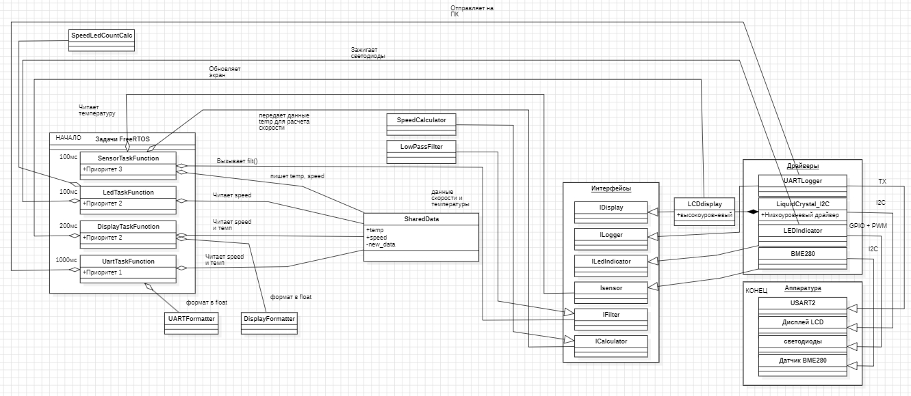

= Архитектура системы управления вентилятором
:toc: auto
:toclevels: 3
:numbered:
:figure-caption: Рисунок
:table-caption: Таблица

== Главные части системы

=== Задачи, которые работают одновременно

[cols="1,3,2,2", options="header"]
|===
| Имя | Что делает | Как часто | Приоритет
| SensorTask | Измеряет температуру, фильтрует, рассчитывает скорость | Каждые 100 мс | 3 (самый высокий)
| DisplayTask | Показывает температуру и скорость на дисплее | Каждые 200 мс | 2
| LedTask | Управляет светодиодами | Каждые 100 мс | 2
| UartTask | Отправляет данные на компьютер | Каждую 1000 мс | 1 (самый низкий)
|===

Все задачи работают независимо и обмениваются данными через общую структуру `SharedData`, в которой хранятся текущая температура, скорость и флаг наличия новых данных.

=== Как работает каждая задача

==== SensorTask (приоритет 3)

. Через интерфейс `ISensor` вызывает метод `ReadTemperature()` у драйвера BME280. Драйвер сам читает сырые данные с датчика по I2C и преобразует их в градусы Цельсия.
. Получает готовую температуру в градусах и передаёт её в фильтр `LowPassFilter` через интерфейс `IFilter` для сглаживания шумов.
. Получает отфильтрованную температуру обратно в задачу.
. Передаёт отфильтрованную температуру в калькулятор `SpeedCalculator` через интерфейс `ICalculator`, который рассчитывает нужную скорость вентилятора по линейной формуле.
. Получает рассчитанную скорость обратно в задачу.
. Записывает в `SharedData` три значения: температуру, скорость и флаг `new_data = true`, сигнализируя другим задачам о появлении свежих данных.

==== DisplayTask (приоритет 2)

. Проверяет флаг `new_data` в структуре `SharedData`.
. Если флаг установлен в `true` (появились свежие данные), читает из `SharedData` температуру и скорость.
. Передаёт температуру в форматтер `DisplayFormatter`, который преобразует число в строку вида `"T: 25.3 C"`.
. Обращается к высокоуровневому драйверу `LcdDisplay` через интерфейс `IDisplay`, передавая ему температуру.
. `LcdDisplay` передаёт готовую строку низкоуровневому драйверу `LiquidCrystal_I2C`.
. `LiquidCrystal_I2C` отправляет команды и данные по I2C на физический дисплей, выводя строку на экран.
. То же самое повторяется для скорости — число превращается в строку и выводится во вторую строку дисплея.

==== LedTask (приоритет 2)

. Читает текущую скорость из `SharedData`.
. Передаёт скорость в калькулятор `SpeedLedCountCalc`, который рассчитывает нужную яркость (скважность ШИМ) для первого светодиода пропорционально скорости, для остальных трёх светодиодов калькулятор сравнивает скорость с порогами: при 30% загорается второй, при 60% — третий, при 90% — четвёртый.
. Получает рассчитанное значение яркости обратно в задачу.
. Через интерфейс `ILedIndicator` передаёт яркость и скорость в драйвер `LEDIndicator`.
. Драйвер `LEDIndicator` устанавливает рассчитанную яркость для первого светодиода через ШИМ и включает светодиоды при выполнении условий.
. Драйвер через GPIO управляет светодиодами.

==== UartTask (приоритет 1)

. Проверяет флаг новых данных в `SharedData`.
. Если данные свежие, читает температуру и скорость из `SharedData`.
. Передаёт температуру в форматтер `UARTFormatter`, который превращает число в строку вида "Temperature: 25.3 C" с добавлением перевода строки.
. Передаёт скорость в форматтер `UARTFormatter`, который превращает число в строку вида "Speed: 75 %" с добавлением перевода строки.
. Через интерфейс `ILogger` обращается к драйверу `UARTLogger`, передавая ему готовые строки.
. Драйвер `UARTLogger` отправляет строки по USART на ПК.

== Почему такие настройки

[cols="2,2,3", options="header"]
|===
| Компонент | Приоритет | Почему
| SensorTask | 3 | Управление вентилятором не должно задерживаться
| DisplayTask | 2 | Экран важен, но может подождать
| LedTask | 2 | Светодиоды важны, но не критичнее датчика
| UartTask | 1 | Логирование — некритично, может быть медленным
|===

[cols="2,2,3", options="header"]
|===
| Задача | Период | Почему
| SensorTask | 100 мс | 10 раз в секунду — достаточно для плавного управления
| DisplayTask | 200 мс | 5 раз в секунду — глаз не замечает обновления
| LedTask | 100 мс | Плавности яркости достаточно
| UartTask | 1000 мс | Одного раза в секунду хватает для логов
|===