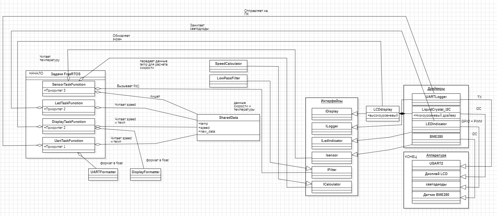

= Архитектура системы управления вентилятором

== Что делает эта программа?

Это система, которая **сама включает и выключает вентилятор** в зависимости от температуры в комнате.

Простыми словами: 

- Если **холодно** (менее 23°C) → вентилятор **выключен**
- Если **нормально** (23-35°C) → вентилятор крутится **быстрее или медленнее**
- Если **жарко** (более 35°C) → вентилятор работает **на полную мощность**

== Главные части системы

=== 1. Помощники (задачи) которые работают одновременно

Это как 4 человека, которые делают разную работу в одно время:

[cols="1,3,2"]
|===
| Имя | Что делает | Как часто
| **Датчик** | Измеряет температуру и решает как крутить вентилятор | Каждые 0.1 секунды (очень часто)
| **Экран** | Показывает температуру и скорость на дисплее | Каждые 0.2 секунды
| **Лампочки** | Зажигает светодиоды в зависимости от скорости | Каждые 0.05 секунды (для плавности)
| **Отправка** | Шлёт данные на компьютер для записи | Каждую 1 секунду
|===

=== 2. Общая записная книжка (SharedData)

Все помощники пишут и читают из одной записной книжки:

[source,cpp]
----
Записная книжка:
- Температура в комнате    (например: 25.3 градуса)
- Скорость вентилятора     (например: 58 процентов)
- Флаг "есть новые данные"  (да/нет)
----

=== 3. Части системы (компоненты)

==== Датчик (BME280) - как градусник

- Висит в комнате и меряет температуру
- Подключен по двум проводам (I2C)
- Адрес на проводах: `0x76`
- Передаёт данные в микроконтроллер

==== Фильтр (LowPassFilter) - как сглаживание

Убирает случайные скачки температуры. Как если бы вы усредняли показания.

Формула для математиков: 

[source, latex]
----
y[n] = y[n-1] + (x[n] - y[n-1]) × τ
----

где:

- x[n] — сырое значение (с датчика)
- y[n-1] — прошлое отфильтрованное значение  
- y[n] — новое отфильтрованное значение
- τ — коэффициент сглаживания

==== Калькулятор скорости (SpeedCalculator) - как мозг

Решает с какой скоростью крутить вентилятор:

[source]
----
Если температура <= 23°C → вентилятор 0% (выключен)
Если температура >= 35°C → вентилятор 100% (максимум)
Если между 23 и 35 → скорость = (температура - 23) / 12 * 100

Пример: при 29°C → скорость = (29-23)/12*100 = 50%
----

==== Экран (LCD Display) - как табло

Показывает две строчки:
[source]
----
T: 25.3 C
Speed: 58%
----

==== Светодиоды (LED) - как лампочки

4 лампочки показывают скорость:

[cols="1,2,2"]
|===
| Лампочка | Где находится | Когда горит
| LED1 | Пин PA5 | Горит тем ярче, чем быстрее вентилятор (как диммер)
| LED2 | Пин PC9 | Загорается при скорости 30% и выше
| LED3 | Пин PC8 | Загорается при скорости 60% и выше
| LED4 | Пин PC5 | Загорается при скорости 90% и выше
|===

==== Отправка на компьютер (UART) - как передача данных

- Передаёт данные на компьютер через провод (пин PA2)
- Скорость передачи: 9600 бод (как старый модем)
- Компьютер видит:

[source]
----
Temperature: 25.3 C
Speed: 58 %
----

== Что происходит внутри микроконтроллера (по шагам)

=== Шаг 1: Всё начинается

[source]
----
1. Включается питание
2. Микроконтроллер просыпается
3. Запускаются все 4 помощника (задачи)
4. Помощники начинают работать каждый в своём ритме
----

=== Шаг 2: Помощник "Датчик" работает

[source]
----
КАЖДЫЕ 0.1 СЕКУНДЫ:
1. Спрашивает у датчика BME280: "Сколько градусов?"
2. Датчик отвечает: "25.3 градуса"
3. Пропускает через фильтр (убирает шумы)
4. Считает скорость: "58%"
5. Записывает в общую книжку:
   - температура = 25.3
   - скорость = 58
   - новые_данные = ДА
----

=== Шаг 3: Помощник "Экран" работает

[source]
----
КАЖДЫЕ 0.2 СЕКУНДЫ:
1. Проверяет: "Появились новые данные?"
2. Видит: "ДА"
3. Читает из книжки: температура = 25.3, скорость = 58
4. Показывает на экране:
   T: 25.3 C
   Speed: 58%
----

=== Шаг 4: Помощник "Лампочки" работает

[source]
----
КАЖДЫЕ 0.05 СЕКУНДЫ:
1. Читает скорость из книжки: 58%
2. Включает LED1 на 58% яркости (ШИМ)
3. LED2: 58% >= 30% → ВКЛ
4. LED3: 58% >= 60% → ВЫКЛ
5. LED4: 58% >= 90% → ВЫКЛ
----

=== Шаг 5: Помощник "Отправка" работает

[source]
----
КАЖДУЮ 1 СЕКУНДУ:
1. Читает данные из книжки
2. Форматирует: "Temperature: 25.3 C"
3. Отправляет на компьютер через провод
4. Форматирует: "Speed: 58 %"
5. Отправляет на компьютер
----

== Почему так сделано?

|===
| Для чего | Как сделано | Почему

| Чтобы вентилятор быстро реагировал | Задача датчика имеет самый высокий приоритет (3) | Вентилятор не должен тупить

| Чтобы экран не мешал датчику | Экран имеет средний приоритет (2) | Плавная картинка не так важна

| Чтобы лампочки горели плавно | Лампочки тоже приоритет 2, но работают чаще (50 мс) | ШИМ требует частого обновления

| Чтобы отправка не тормозила всё | Отправка имеет самый низкий приоритет (1) | Отправка по проводу медленная
|===

