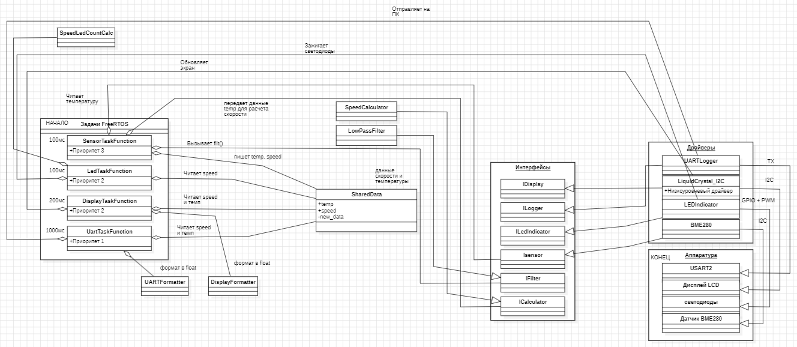

== Детальное описание классов архитектуры

=== 1. Общие данные

==== SharedData

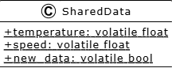

Структура для обмена данными между задачами FreeRTOS.

**Атрибуты:**
- `temperature` — текущая отфильтрованная температура в градусах Цельсия (volatile float)
- `speed` — скорость вентилятора в процентах (volatile float)
- `new_data` — флаг появления новых данных (volatile bool)

=== 2. Задачи FreeRTOS

==== 2.1 SensorTask

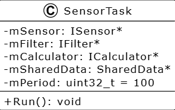

Задача чтения датчика, фильтрации и расчёта скорости.

**Период:** 100 мс
**Приоритет:** 3 (высокий)

**Атрибуты:**
- `mSensor` — указатель на датчик температуры (ISensor)
- `mFilter` — указатель на фильтр (IFilter)
- `mCalculator` — указатель на вычислитель скорости (ICalculator)
- `mSharedData` — указатель на общие данные
- `mPeriod` — период выполнения задачи (100 мс)

**Метод `Run()`:** основной цикл задачи. Последовательно вызывает чтение BME280, фильтрацию, расчёт скорости и сохранение результата в SharedData. Самый высокий приоритет необходим для получения свежих данных без задержек.

==== 2.2 LedTask

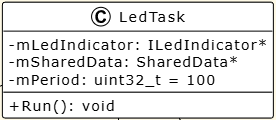

Задача управления светодиодной индикацией.

**Период:** 100 мс
**Приоритет:** 2

**Атрибуты:**
- `mLedIndicator` — указатель на индикатор (ILedIndicator)
- `mSharedData` — указатель на общие данные
- `mPeriod` — период выполнения задачи (100 мс)

**Метод `Run()`:** читает скорость из SharedData и обновляет состояние светодиодов.

==== 2.3 DisplayTask

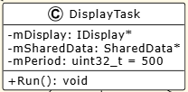

Задача вывода информации на дисплей.

**Период:** 500 мс
**Приоритет:** 1 (низкий)

**Атрибуты:**
- `mDisplay` — указатель на дисплей (IDisplay)
- `mSharedData` — указатель на общие данные
- `mPeriod` — период выполнения задачи (500 мс)

**Метод `Run()`:** читает температуру и скорость из SharedData и выводит их на дисплей. Низкий приоритет допустим, так как обновление дисплея не критично по времени.

==== 2.4 UartTask

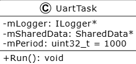

Задача отправки данных на компьютер через USART.

**Период:** 1000 мс
**Приоритет:** 1 (низкий)

**Атрибуты:**
- `mLogger` — указатель на логгер (ILogger)
- `mSharedData` — указатель на общие данные
- `mPeriod` — период выполнения задачи (1000 мс)

**Метод `Run()`:** читает температуру и скорость из SharedData и отправляет их через USART. Низкий приоритет допустим, так как вывод на ПК не критичен для работы системы.

=== 3. Интерфейсы

==== 3.1 ISensor

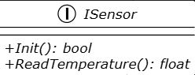

Интерфейс для всех датчиков температуры.

- `Init()` — инициализация датчика. Возвращает `true` при успешном подключении
- `ReadTemperature()` — чтение температуры в градусах Цельсия

==== 3.2 IFilter

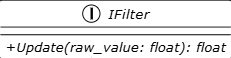

Интерфейс для цифровых фильтров.

- `Update(raw_value)` — обновление фильтра. Принимает сырое значение с датчика, возвращает отфильтрованное значение

==== 3.3 ICalculator

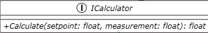

Интерфейс для вычислителей скорости вентилятора.

- `Calculate(setpoint, measurement)` — расчёт скорости. Параметры: `setpoint` — целевая температура (уставка), `measurement` — текущая температура. Возвращает скорость в процентах (0–100%)

==== 3.4 ILedIndicator

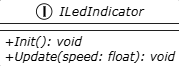

Интерфейс для управления светодиодной индикацией.

- `Init()` — инициализация GPIO и ШИМ для светодиодов
- `Update(speed)` — обновление состояния светодиодов. Параметр: `speed` — скорость вентилятора (0–100%)

==== 3.5 IDisplay

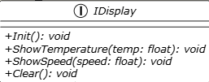

Интерфейс для дисплея.

- `Init()` — инициализация дисплея
- `ShowTemperature(temp)` — вывод температуры на дисплей
- `ShowSpeed(speed)` — вывод скорости на дисплей
- `Clear()` — очистка экрана

==== 3.6 ILogger

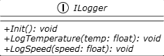

Интерфейс для логирования данных (отправка на ПК).

- `Init()` — инициализация UART
- `LogTemperature(temp)` — отправка температуры на ПК
- `LogSpeed(speed)` — отправка скорости на ПК

=== 4. Компоненты

==== 4.1 LowPassFilter (реализует IFilter)

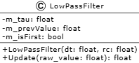

Фильтр нижних частот 1-го порядка (экспоненциальное сглаживание).

**Атрибуты:**
- `m_tau` — коэффициент сглаживания (α)
- `m_prevValue` — предыдущее отфильтрованное значение
- `m_isFirst` — флаг первого вызова

**Методы:**
- `LowPassFilter(dt, rc)` — конструктор. Рассчитывает `tau = 1 - e^(-dt/rc)`. Для `dt = 0.1 с` и `rc = 2.0 с` значение `tau ≈ 0.0488`
- `Update(raw_value)` — фильтрация по формуле `y = y_prev + (x - y_prev) × tau`. При первом вызове возвращает сырое значение без фильтрации

==== 4.2 SpeedCalculator (реализует ICalculator)

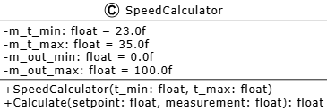

Линейный регулятор скорости вентилятора.

**Атрибуты:**
- `m_t_min` — минимальная температура (скорость 0%), значение 23.0 °C
- `m_t_max` — максимальная температура (скорость 100%), значение 35.0 °C
- `m_out_min` — минимальная скорость (0%)
- `m_out_max` — максимальная скорость (100%)

**Методы:**
- `SpeedCalculator(t_min, t_max)` — конструктор
- `Calculate(setpoint, measurement)` — расчёт скорости по формуле: `(T - 23) / 12 × 100%` с ограничением 0–100%. Если температура ≤ 23°C, скорость 0%. Если температура ≥ 35°C, скорость 100%. В остальных случаях — линейная интерполяция

=== 5. Форматтеры

==== 5.1 DisplayFormatter

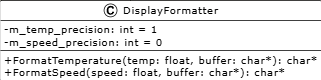

Форматирование данных для вывода на LCD дисплей.

**Атрибуты:**
- `m_temp_precision` — количество знаков после запятой для температуры (по умолчанию 1)
- `m_speed_precision` — количество знаков после запятой для скорости (по умолчанию 0)

**Методы:**
- `FormatTemperature(temp, buffer)` — форматирование температуры в строку вида `"T: 24.3 C"`
- `FormatSpeed(speed, buffer)` — форматирование скорости в строку вида `"S: 45%"`

==== 5.2 UARTFormatter

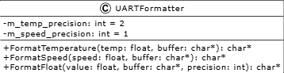

Форматирование данных для отправки по USART.

**Атрибуты:**
- `m_temp_precision` — количество знаков после запятой для температуры (по умолчанию 2)
- `m_speed_precision` — количество знаков после запятой для скорости (по умолчанию 1)

**Методы:**
- `FormatTemperature(temp, buffer)` — форматирование температуры в строку вида `"Temperature: 24.35 C\r\n"`
- `FormatSpeed(speed, buffer)` — форматирование скорости в строку вида `"Speed: 45.0 %\r\n"`
- `FormatFloat(value, buffer, precision)` — внутренний метод форматирования числа с плавающей точкой без использования `sprintf`

=== 6. Драйверы

==== 6.1 LiquidCrystal_I2C

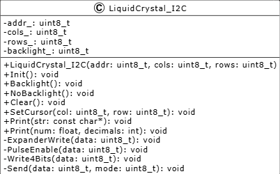

Драйвер LCD дисплея с I2C интерфейсом на базе расширителя портов PCF8574.

**Атрибуты:**
- `addr_` — I2C адрес модуля (по умолчанию 0x27)
- `cols_` — количество колонок (16)
- `rows_` — количество строк (2)
- `backlight_` — состояние подсветки (0x08 — включена, 0x00 — выключена)

**Методы:**
- `LiquidCrystal_I2C(addr, cols, rows)` — конструктор
- `Init()` — инициализация LCD: задержка после включения, переход в 4-битный режим, настройка размера 16×2, включение дисплея, очистка
- `Backlight()` — включение подсветки
- `NoBacklight()` — выключение подсветки
- `Clear()` — очистка экрана и возврат курсора в начало
- `SetCursor(col, row)` — установка позиции курсора. Для строки 0 адрес 0x80 + col, для строки 1 адрес 0xC0 + col
- `Print(str)` — вывод строки на дисплей
- `Print(num, decimals)` — вывод числа с плавающей точкой с указанным количеством знаков после запятой
- `ExpanderWrite(data)` — отправка байта на расширитель портов через I2C
- `PulseEnable(data)` — формирование строба Enable (E=1 → E=0) для фиксации данных
- `Write4Bits(data)` — отправка 4 бит данных
- `Send(data, mode)` — отправка полного байта в 4-битном режиме. mode = 0 для команды, mode = 1 для данных

==== 6.2 UARTLogger (реализует ILogger)

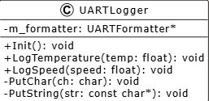

Отправка данных через USART2 на компьютер.

**Атрибуты:**
- `m_formatter` — указатель на UARTFormatter

**Методы:**
- `Init()` — настройка USART2: скорость 9600 бод, 8 бит данных, 1 стоп-бит, без чётности. Пин PA2 (TX) настраивается в альтернативный режим AF7
- `LogTemperature(temp)` — форматирование температуры через UARTFormatter и отправка строки через USART
- `LogSpeed(speed)` — форматирование скорости через UARTFormatter и отправка строки через USART
- `PutChar(ch)` — отправка одного символа. Ожидает освобождения буфера передатчика (бит TXE в регистре USART2_SR), затем записывает байт в регистр USART2_DR
- `PutString(str)` — отправка строки. Для каждого символа вызывает `PutChar()`. При символе `\n` дополнительно отправляет `\r`

==== 6.3 LEDIndicator (реализует ILedIndicator)

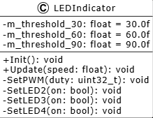

Управление светодиодами.

**Атрибуты:**
- `m_threshold_30` — порог включения LED2 (30%)
- `m_threshold_60` — порог включения LED3 (60%)
- `m_threshold_90` — порог включения LED4 (90%)

**Методы:**
- `Init()` — настройка GPIO для портов A (PA5) и C (PC5, PC8, PC9), настройка таймера TIM2 для ШИМ на PA5. Частота ШИМ настраивается на 1 кГц
- `Update(speed)` — установка яркости LED1 через ШИМ (пропорционально скорости), включение LED2 при скорости ≥ 30%, LED3 при скорости ≥ 60%, LED4 при скорости ≥ 90%
- `SetPWM(duty)` — установка скважности ШИМ для LED1
- `SetLED2(on)` — включение/выключение LED2 (пин PC9)
- `SetLED3(on)` — включение/выключение LED3 (пин PC8)
- `SetLED4(on)` — включение/выключение LED4 (пин PC5)

==== 6.4 BME280 (реализует ISensor)

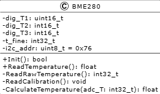

Драйвер датчика BME280 с интерфейсом I2C.

**Атрибуты:**
- `dig_T1` — калибровочный коэффициент (uint16_t), читается из регистров 0x88-0x89
- `dig_T2` — калибровочный коэффициент (int16_t), читается из регистров 0x8A-0x8B
- `dig_T3` — калибровочный коэффициент (int16_t), читается из регистров 0x8C-0x8D
- `t_fine` — промежуточное значение (int32_t), используется также для давления и влажности
- `i2c_addr` — I2C адрес датчика (по умолчанию 0x76)

**Методы:**
- `Init()` — инициализация датчика: проверка Chip ID (0x60), сброс (запись 0xB6 в регистр 0xE0), чтение калибровочных коэффициентов, настройка режима работы (0x23 в регистр 0xF4)
- `ReadTemperature()` — чтение RAW температуры и преобразование в градусы Цельсия
- `ReadRawTemperature()` — чтение 20-битного RAW значения из регистров 0xFA-0xFC
- `ReadCalibration()` — чтение калибровочных коэффициентов из ПЗУ датчика
- `CalculateTemperature(adc_T)` — преобразование RAW в °C по формуле из даташита