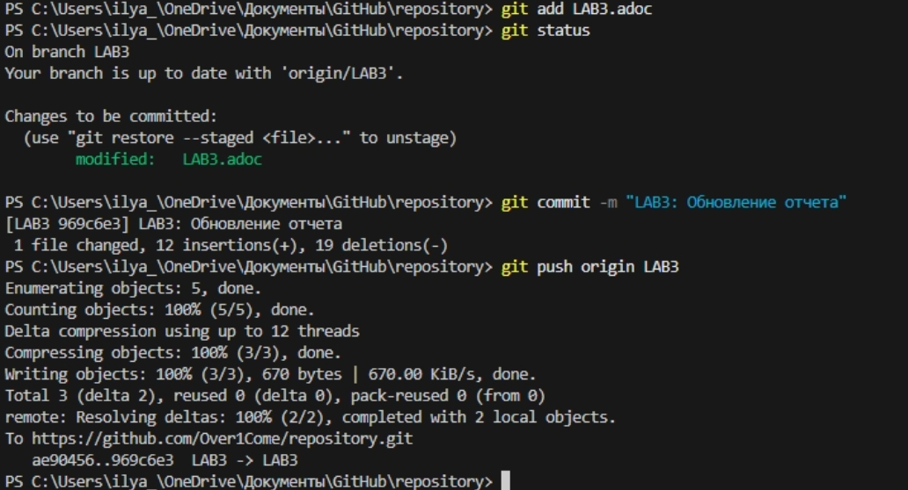
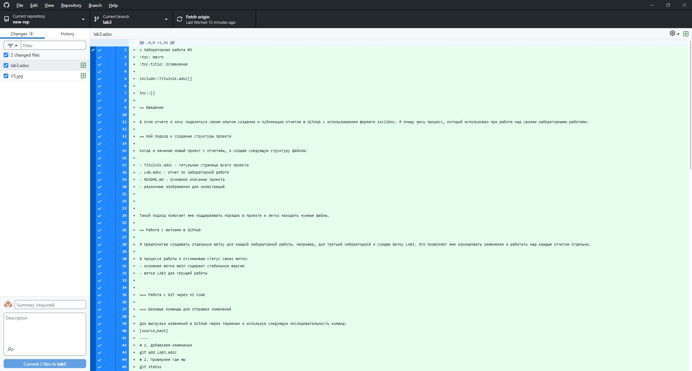
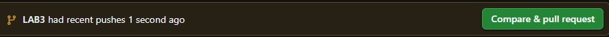

= Лабораторная работа №3
:toc: macro
:toc-title: Оглавление

include::Titulnik.adoc[]

toc::[]

== Введение

В этом отчете я хочу поделиться своим опытом создания и публикации отчетов в GitHub с использованием формата AsciiDoc. Я опишу весь процесс, который использовал при работе над своими лабораторными работами.

== Мой подход к созданию структуры проекта

Когда я начинаю новый проект с отчетами, я создаю следующую структуру файлов:

- Titulnik.adoc - титульная страница всего проекта
- LAB.adoc - отчет по лабораторной работе
- README.md - основное описание проекта
- различные изображения для иллюстраций

Такой подход помогает мне поддерживать порядок в проекте и легко находить нужные файлы.

== Работа с ветками в GitHub

Я предпочитаю создавать отдельную ветку для каждой лабораторной работы. Например, для третьей лабораторной я создаю ветку LAB3. Это позволяет мне изолировать изменения и работать над каждым отчетом отдельно.

В процессе работы я отслеживаю статус своих веток:
- основная ветка main содержит стабильную версию
- ветка LAB3 для текущей работы

=== Работа с Git через VS Code

=== Базовые команды для отправки изменений

Для выгрузки изменений в GitHub через терминал я использую следующую последовательность команд:
[source,bash]
----
# 1. Добавляем изменения
git add LAB3.adoc
# 2. Проверяем где мы
git status
# 3. Коммитим
git commit -m "LAB3: Обновление отчета"
# 4. Пушим в ветку LAB3
git push origin LAB3
----

== Мой workflow коммитов и публикации

Когда я заканчиваю работать над отчетом, я выполняю следующие действия:

1. Проверяю все измененные файлы в разделе Changes
2. Пишу понятное описание изменений в поле Summary
3. Выполняю коммит в текущую ветку (например, LAB3)
4. Отправляю изменения: `git push origin LAB3`
5. Создаю Pull Request для слияния с основной веткой

== Создание Pull Request

Когда я готов объединить свою работу с основной веткой, я создаю Pull Request через интерфейс VS Code:

1. Устанавливаю расширение "GitHub Pull Requests"
2. После push ветки создаю PR через командную палитру (Ctrl+Shift+P)
3. Заполняю информацию о изменениях
4. После мерджа удаляю ветку LAB3

После создания PR я всегда проверяю предпросмотр, чтобы убедиться, что все отображается корректно.

== Проверка и доработка отчета

Перед окончательной отправкой работы я всегда проверяю:
- все ли файлы отчета добавлены
- работают ли ссылки между документами
- корректно ли отображаются изображения
- правильно ли оформлено форматирование

Для предпросмотра я использую расширение AsciiDoc в VS Code, которое позволяет сразу видеть, как будет выглядеть конечный документ.

== Вывод

В ходе лабораторной работы я освоил полный цикл работы с Git и GitHub. Научился:

* Создавать структурированные проекты в AsciiDoc
* Использовать VS Code и терминал для управления репозиторием
* Создавать Pull Request и управлять слияниями
* Контролировать качество документации

Приобретенные навыки работы с системами контроля версий будут полезны для будущей профессиональной деятельности в разработке ПО.