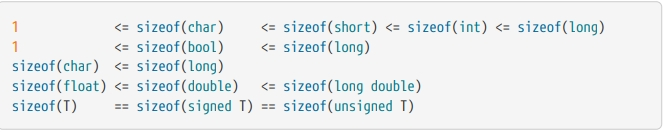
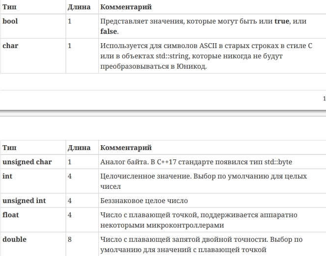
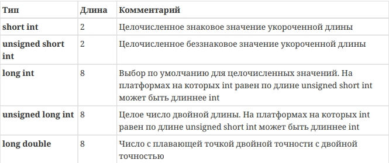
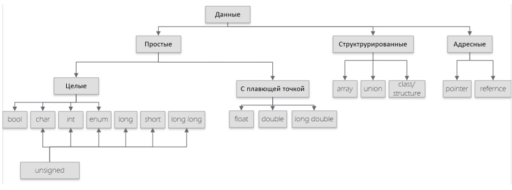
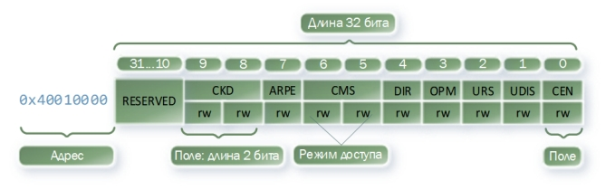
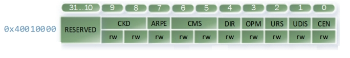

= Лабораторная работа №4
:toc: macro
:toc-title: Оглавление
:figure-caption: Рисунок
include::Titulnik.adoc[]

toc::[]

== Введение

== Цель работы
Изучение основ портируемости ПО для встраиваемых систем, типов данных в C++, работы с указателями и регистрами микроконтроллера STM32.

== Теоретическая часть

=== Типы данных в C++

==== Базовые типы - размеры не фиксированы

В C++ размеры типов могут плавать.

*Типы и размеры:*

*ПРОСТЫЕ:*

1) **Целые:**

* `bool`(1 байт) - логический тип: `true` или `false`

* `char`(1 байт) - символьный тип, часто используется для байтовых операций

* `int`(4 байта) - основной целочисленный тип

* `enum`(зависит от компилятора) - перечисление, задаёт набор именованных констант

* `long`(4 или 8 байт) - длинное целое (размер зависит от архитектуры)

* `short`(2 байта) - короткое целое

* `long long`(8 байт) - очень длинное целое

* `unsigned`(как соответствующий signed) - беззнаковая версия любого целого типа

* `unsigned`  Как соответствующий signed  Беззнаковая версия любого целого типа

2) **C плавающей точкой:**

* `float`(4 байта) - число с плавающей точкой одинарной точности (~7 знаков)

* `double`(8 байт) - число с плавающей точкой двойной точности (~15 знаков)

* `long double`(8+ байт) - расширенная точность (зависит от платформы)

*СТРУКТУРИРОВАННЫЕ:*

* `array` - массив фиксированного размера: `std::array<int, 10> arr`

* `union` - объединение — все члены используют одну память

* `class` / `struct` - пользовательский тип с методами и данными

*АДРЕСНЫЕ:*

* `pointer` (указатель) - хранит адрес в памяти: `int* ptr = &var`

* `reference` (ссылка) - псевдоним переменной: `int& ref = var`

*ПОЛЬЗОВАТЕЛЬСКИЕ ТИПЫ:*

   * Любые классы и структуры, которые создает программист

==== Правила какие есть (неравенства)

.неравенства

.встроенные типы

.модификаторы типов

.таблица типов данных C++

==== Надежные типы

Чтобы не гадать, используем фиксированные типы:

- uint8_t - точно 1 байт, беззнаковый
- int16_t - точно 2 байта, знаковый  
- uint32_t - точно 4 байта, беззнаковый
- int64_t - точно 8 байт, знаковый

=== Преобразования типов

==== Неявное преобразование

Компилятор автоматически преобразует типы:

[source,cpp]
----
int a = 3.14; // a = 3
bool b = -5;  // b = true
----

==== Явное преобразование

**Зачем нужно явное преобразование?**

Когда компилятор делает преобразование сам (неявно), он может натворить дел. Например:

[source,cpp]
----
double angle = 90.5;
int degrees = angle; // Компилятор сам отрежет 0.5
// degrees = 90, но мы об этом не просили!
----

**Почему использовать явное?**

1. **Понятность кода** - видно, что преобразование специальное
2. **Контроль** - мы говорим компилятору "я знаю что делаю"
3. **Безопасность** - меньше скрытых багов

**Как использовать:**

[source,cpp]
----
double angle = 90.5;
int degrees = static_cast<int>(angle); // Явно говорим: "преобразуй в int"
// Теперь видно, что дробную часть отбросили специально
----

**Основные виды явного преобразования:**

- static_cast - для обычных преобразований (int→float и т.д.)
- reinterpret_cast - для работы с указателями и адресами (как в нашей лабе)
- const_cast - чтобы убрать/добавить const
- dynamic_cast - для классов и наследования

=== Указатели и ссылки

==== Указатели

**Что такое указатель?**

Указатель — это переменная, которая хранит **адрес в памяти** где лежат данные, а не сами данные.

**Простой пример:**

[source,cpp]
----
int value = 100;    // Создали переменную со значением 100
int* ptr = &value;  // ptr хранит АДРЕС где лежит value
*ptr = 200;         // Меняем value через его адрес
----

**Что происходит:**

1. value — обычная переменная, в ней число 100
2. &value — оператор "взять адрес", получаем где в памяти лежит value
3. ptr — указатель, в нем не 100, а адрес ячейки памяти
4. *ptr — оператор "разыменование", получаем доступ к данным по адресу

**Зачем нужны указатели?**

- Работа с аппаратными регистрами 
- Эффективная передача больших данных
- Динамическое выделение памяти 
- Организация сложных структур данных

==== Ссылки

**Что такое ссылка?**

Ссылка — это **псевдоним переменной**, альтернативное имя для уже существующих данных.

**Простой пример:**

[source,cpp]
----
int value = 100;    // Оригинальная переменная
int& ref = value;   // ref — это другое имя для value
ref = 200;          // Меняем value через ссылку
----

**Ключевые особенности ссылок:**

- Ссылка должна быть инициализирована при создании
- Нельзя изменить на что ссылается после инициализации
- Не занимает дополнительной памяти (это просто другое имя)
- Синтаксически работает как обычная переменная

=== Регистры

Регистр - ячейка памяти внутри процессора или периферийного модуля для хранения данных и управления устройством.

==== Регистры STM32

* R0-R12 - регистры общего назначения
* R13 (SP) - указатель стека
* R14 (LR) - регистр связи
* R15 (PC) - счётчик команд

*Регистры периферии* - управляют устройствами микроконтроллера через память:

* RCC (Reset and Clock Control) - управление тактированием периферии

* GPIOx - регистры портов ввода-вывода (MODER, ODR, IDR)

* TIMx - регистры таймеров (PSC, ARR, CNT)

* USARTx - регистры последовательных портов
Каждый периферийный модуль имеет свои регистры для настройки и управления.

.cхематичное изображение регистра

.регистр CR1 таймера 1

== Практическая часть

=== Код

include::kod.adoc[]

=== Описание работы программы

==== Инициализация тактирования

Программа начинает с настройки тактовой частоты микроконтроллера через регистры RCC. Используется внутренний генератор HSI (16 МГц).

[source,cpp]
----
RCC::CR::HSION::On::Set();
while (RCC::CR::HSIRDY::NotReady::IsSet())
{
}
RCC::CFGR::SW::Hsi::Set();
----

==== Настройка портов ввода-вывода

Что делаем своими словами:

**Включаем питание портов**:

[source,cpp]
----
RCC::AHB1ENR::GPIOAEN::Enable::Set(); // Включили порт A
RCC::AHB1ENR::GPIOCEN::Enable::Set(); // Включили порт C
----

Без этого пины просто не будут работать

**Говорим пинам кто они** - выходы или входы:

[source,cpp]
----
GPIOA::MODER::MODER5::Output::Set();  // Пин A5 - выход (светодиод 1)
GPIOC::MODER::MODER5::Output::Set();  // Пин C5 - выход (светодиод 2)
GPIOC::MODER::MODER8::Output::Set();  // Пин C8 - выход (светодиод 3)  
GPIOC::MODER::MODER9::Output::Set();  // Пин C9 - выход (светодиод 4)
----

**Про кнопку** - пин PC13 по умолчанию настроен как вход (так устроена плата), поэтому его отдельно не настраиваем.

==== Работа с указателями

Для прямого доступа к регистрам используются указатели с преобразованием типов:

[source,cpp]
----
std::uint32_t* const gpiocOdrPtr = reinterpret_cast<std::uint32_t*>(0x40020814);
std::uint32_t* const gpiocIdrPtr = reinterpret_cast<std::uint32_t*>(0x40020810);
----

* gpiocOdrPtr - указатель на регистр выходных данных порта C
* gpiocIdrPtr - указатель на регистр входных данных порта C

==== Обработка кнопки

Программа в бесконечном цикле проверяет состояние кнопки на пине PC13:

[source,cpp]
----
auto volatile idrValue = *gpiocIdrPtr;
bool isButtonPressed = ((idrValue & (1<<13)) == 0);
----

При нажатии кнопки переключается состояние светодиода на пине PC5 с использованием битовых операций:

[source,cpp]
----
*gpiocOdrPtr |= (1<<5);    // Включить светодиод
*gpiocOdrPtr &= ~(1<<5);   // Выключить светодиод
----

=== Результаты работы

.Работающая плата STM32, width=500
image::platka.jpg[]

Программа успешно управляет светодиодами на плате STM32F411. При нажатии кнопки на пине PC13 происходит переключение состояния светодиода на пине PC5.

== Выводы
1. Использование типов uint32_t обеспечивает переносимость кода между разными архитектурами
2. Преобразование reinterpret_cast позволяет работать с аппаратными регистрами через указатели
3. Прямой доступ к регистрам ODR и IDR через указатели обеспечивает эффективное управление периферией
4. Битовые операции используются для управления отдельными пинами GPIO
5. Программа демонстрирует практическое применение указателей для работы с аппаратными регистрами микроконтроллера