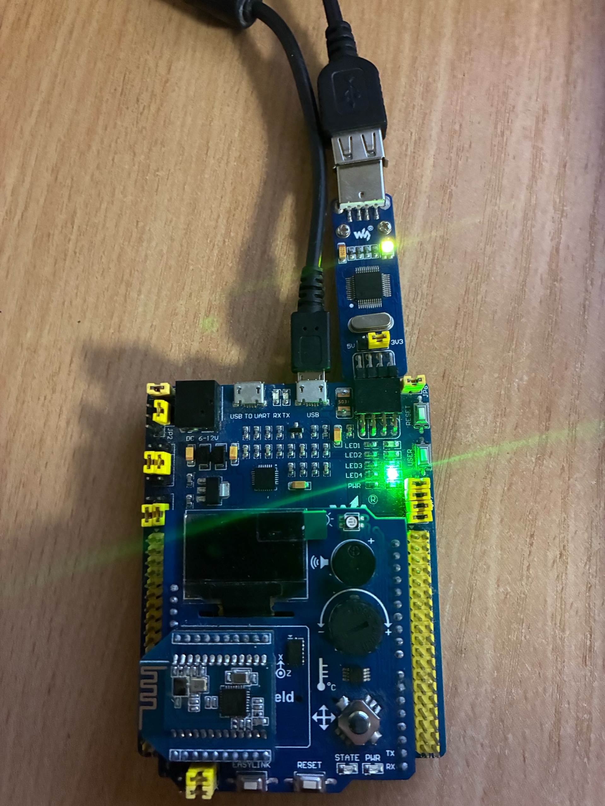

= Лабораторная работа №4
:toc: macro
:toc-title: Оглавление

include::Titulnik.adoc[]

toc::[]

== Введение

== Цель работы
Изучение основ портируемости ПО для встраиваемых систем, типов данных в C++, работы с указателями и регистрами микроконтроллера STM32.

== Теоретическая часть

=== Типы данных в C++

==== Базовые типы
* `bool` - логический тип (1 байт)
* `char` - символьный тип (1 байт) 
* `int` - целочисленный (4 байта)
* `float` - с плавающей точкой (4 байта)
* `double` - двойной точности (8 байт)

==== Модификаторы типов
* `short` - укороченный (2 байта)
* `long` - удлинённый (8 байт)
* `unsigned` - беззнаковый

==== Типы фиксированного размера
Для обеспечения портируемости используются типы из <cstdint>:
* `uint8_t` - 8-битное беззнаковое
* `int16_t` - 16-битное знаковое
* `uint32_t` - 32-битное беззнаковое

=== Преобразования типов

==== Неявное преобразование
Компилятор автоматически преобразует типы:

[source,cpp]
----
int a = 3.14; // a = 3
bool b = -5;  // b = true
----

==== Явное преобразование
* `static_cast` - для безопасных преобразований
* `reinterpret_cast` - для работы с указателями и памятью
* `const_cast` - для управления константностью

=== Указатели и ссылки

==== Указатели
Указатель - переменная, хранящая адрес памяти:

[source,cpp]
----
int value = 100;
int* ptr = &value;
*ptr = 200;
----

Операции с указателями:
* `&` - взятие адреса
* `*` - разыменование  
* `+`, `-`, `++`, `--` - арифметика указателей

==== Ссылки
Ссылка - псевдоним переменной:

[source,cpp]
----
int original = 5;
int& ref = original;
ref = 10;
----

Отличия от указателей:
* Должны быть инициализированы при объявлении
* Не могут быть перенаправлены
* Не поддерживают арифметические операции

=== Регистры
Регистр - ячейка памяти внутри процессора или периферийного модуля для хранения данных и управления устройством.

==== Регистры STM32
* R0-R12 - регистры общего назначения
* R13 (SP) - указатель стека
* R14 (LR) - регистр связи
* R15 (PC) - счётчик команд

== Практическая часть

=== Код
include::kod.adoc[]

=== Описание работы программы

==== Инициализация тактирования
Программа начинает с настройки тактовой частоты микроконтроллера через регистры RCC. Используется внутренний генератор HSI (16 МГц).

[source,cpp]
----
RCC::CR::HSION::On::Set();
while (RCC::CR::HSIRDY::NotReady::IsSet())
{
}
RCC::CFGR::SW::Hsi::Set();
----

==== Настройка портов ввода-вывода
Включается тактирование портов A и C, затем настраиваются пины:
* PA5, PC5, PC8, PC9 - как выходы (светодиоды)
* PC13 - как вход (кнопка)

[source,cpp]
----
RCC::AHB1ENR::GPIOAEN::Enable::Set();
RCC::AHB1ENR::GPIOCEN::Enable::Set();
GPIOA::MODER::MODER5::Output::Set();
GPIOC::MODER::MODER5::Output::Set();
----

==== Работа с указателями
Для прямого доступа к регистрам используются указатели с преобразованием типов:

[source,cpp]
----
std::uint32_t* const gpiocOdrPtr = reinterpret_cast<std::uint32_t*>(0x40020814);
std::uint32_t* const gpiocIdrPtr = reinterpret_cast<std::uint32_t*>(0x40020810);
----

* `gpiocOdrPtr` - указатель на регистр выходных данных порта C
* `gpiocIdrPtr` - указатель на регистр входных данных порта C

==== Обработка кнопки
Программа в бесконечном цикле проверяет состояние кнопки на пине PC13:

[source,cpp]
----
auto volatile idrValue = *gpiocIdrPtr;
bool isButtonPressed = ((idrValue & (1<<13)) == 0);
----

При нажатии кнопки переключается состояние светодиода на пине PC5 с использованием битовых операций:

[source,cpp]
----
*gpiocOdrPtr |= (1<<5);    // Включить светодиод
*gpiocOdrPtr &= ~(1<<5);   // Выключить светодиод
----

=== Результаты работы

Программа успешно управляет светодиодами на плате STM32F411. При нажатии кнопки на пине PC13 происходит переключение состояния светодиода на пине PC5.

== Выводы
1. Использование типов `uint32_t` обеспечивает переносимость кода между разными архитектурами
2. Преобразование `reinterpret_cast` позволяет работать с аппаратными регистрами через указатели
3. Прямой доступ к регистрам ODR и IDR через указатели обеспечивает эффективное управление периферией
4. Битовые операции используются для управления отдельными пинами GPIO
5. Программа демонстрирует практическое применение указателей для работы с аппаратными регистрами микроконтроллера