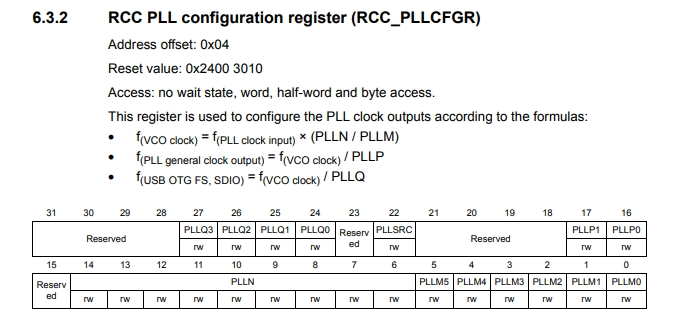
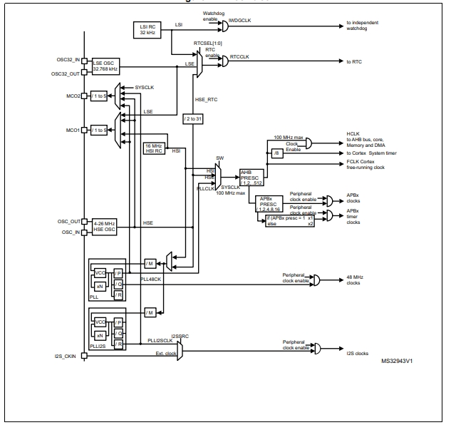

= Лабораторная работа №6
:toc: 
:toc-title: Содержание
:figure-caption: Рисунок
:source-highlighter: coderay  
:coderay-css: style           
:icons: font

include::Titulnik.adoc[]

toc::[]

== Цель работы
. Разобраться почему не работает кнопка.
. Вместо системного таймера подключить таймер TIM2.
. Изучить и описать как реализовать настройку системы тактирования микроконтроллера STM32F411RE на внешний и внутренний источник тактирования.
. Добавить про порты ввода-вывода (GPIO) для управления периферией их настройку, как они работают и зачем нужны.
. Не отчислиться (опционально).

== 1. Почему не работала кнопка?

Кнопка не работала, потому что студент, который расшаривал экран нажимал на кнопку reset, а не UserButton.

== 2. Замена системного таймера на TIM2

=== 2.1 Что такое системный таймер и зачем его менять

*Системный таймер (SysTick)* — это самый простой таймер, который встроен прямо в ядро процессора Cortex-M.

**Его главные задачи:**

. *Считать время*
. *Создавать задержки*
. *Работать как системные часы*

**Пример настройки SysTick:**

[source,cpp]
----
// Настройка SysTick на прерывание каждые 1 мс (при частоте 16 МГц)
void SysTick_Init(void) {
    SysTick->LOAD = 16000 - 1;     // 16 МГц / 1000 Гц - 1 = 15999
    SysTick->VAL = 0;              // Сбросить текущее значение
    SysTick->CTRL = SysTick_CTRL_TICKINT_Msk |  // Включить прерывания                  
}

// Обработчик прерывания SysTick (вызывается каждую 1 мс)
volatile uint32_t ticks = 0;
extern "C" void SysTick_Handler(void) {
    ticks++;  // Просто считаем миллисекунды
}

// Функция задержки на основе SysTick
void Delay_ms(uint32_t ms) {
    uint32_t start = ticks;
    while ((ticks - start) < ms) {
        // Ждём...
    }
}
----

**Почему мы его меняем на TIM2?**

. Освобождаем SysTick

. TIM2 более гибкий 

. Учимся работать с периферией 

. Не мешаем системным функциям 

=== 2.2 Как мы настроили TIM2

Первым делом в функции *__low_level_init()* добавили вот эту строчку:

[source,cpp]
----
RCC::APB1ENR::TIM2EN::Enable::Set();  // Включили таймер TIM2
----

В STM32 все железки по умолчанию выключены, чтобы не жрали батарейку. Так что если не включить таймер — он просто не будет работать.

Потом сделали две функции:
[source,cpp]
----
// Проверяет, прошло ли время
bool IsTimeoutExpired()
{
  if (TIM2::SR::UIF::InterruptPending::IsSet()) // Если флаг поднят
  {
    TIM2::SR::UIF::Set(0); // Опускаем флажок
    return true; // Говорим, что время вышло
  }
  return false; // Время еще не вышло
}

// Ставит таймер на нужное время
void SetTimeout(std::uint32_t delayInms)
{
  TIM2::PSC::Set(timPresc - 1U); // Настраиваем делитель частоты
  TIM2::ARR::Write(delayInms * timPeriod); // Говорим, сколько тиков ждать
  TIM2::SR::UIF::Set(0); // Сбрасываем флаг (на всякий случай)
  TIM2::CNT::Set(0); // Обнуляем счетчик
  TIM2::CR1::CEN::Set(1); // Запускаем таймер
}
----

В главной программе используем это так:
[source,cpp]
----
SetTimeout(200U); // Поставили таймер на 200 мс

for(;;) // Бесконечный цикл
{  
  if (IsTimeoutExpired()) // Каждые 200 мс здесь будет true
  {
    if (userButton.WasPressed()) // Проверяем кнопку
    {
      modeController.SwitchMode(); // Меняем режим мигания
    }
    modeController.RunCurrentMode(); // Делаем что должен делать текущий режим
  } 
}
----

=== 2.3 Как это все работает на пальцах

1. *Частота*: У нас процессор работает на 16 МГц (HSI). Мы не стали его делить, так что таймер тоже тикает 16 миллионов раз в секунду.

2. *Считаем тики*: Для 1 мс нужно 16,000 тиков (16,000,000 / 1000). Вот откуда взялось число 15,999 в формуле — потому что счет начинается с нуля.

3. *Ставим будильник*: Когда мы говорим *SetTimeout(200)*, таймеру говорим: "Проснись через 200 × 16,000 = 3,200,000 тиков". Это как завести механический будильник.

4. *Ждем звонка*: Таймер тикает, тикает, и когда досчитывает до нужного числа — поднимает флажок (UIF). Мы в основном цикле постоянно спрашиваем: "Флажок поднят?" Когда видим, что поднят — опускаем его и делаем свои дела.

5. *Фишка*: Раньше мы каждый раз заводили и останавливали таймер. Сейчас он работает постоянно, просто мы смотрим на него каждые 200 мс. Это как часы на руке — они всегда идут, а мы просто смотрим на них, когда нужно.

6. *Про кнопку*: Мы проверяем кнопку не постоянно, а раз в 200 мс. Это достаточно часто, чтобы пользователь не заметил задержку, и достаточно редко, чтобы не ловить дребезг контактов.

== 3. Настройка системы тактирования

=== 3.1 Использование внутреннего генератора HSI
Программа использует внутренний RC-генератор HSI на частоте 16 МГц:

[source,cpp]
----
const std::uint32_t SystemCoreClock = 16000000U; // HSI частота
----

Настройка в функции __low_level_init():
[source,cpp]
----
RCC::CR::HSION::On::Set();
while (RCC::CR::HSIRDY::NotReady::IsSet()) {}
RCC::CFGR::SW::Hsi::Set();
while (!RCC::CFGR::SWS::Hsi::IsSet()) {}
----

=== 3.2 Включение и настройка внешнего кварца (если бы использовали его)

[source,cpp]
----
RCC::CR::HSEON::On::Set();
while (RCC::CR::HSERDY::NotReady::IsSet()) {}
----
Включает внешний кварцевый генератор на 8 МГц и ждёт, пока он стабилизируется

[source,cpp]
----
RCC::CFGR::SW::Hse::Set();
while (!RCC::CFGR::SWS::Hse::IsSet()) {}
----
Переключает систему на работу от HSE и ждёт подтверждения переключения.

[source,cpp]
----
RCC::CR::HSION::Off::Set();
----
Выключает внутренний RC-генератор HSI (16 МГц), чтобы экономить энергию, так как теперь используем внешний кварц.

=== 3.3 Настройка PLL (если делать через него)
Делитель M = 2 (8 МГц / 2 = 4 МГц)

Множитель N = 64 (4 МГц × 64 = 256 МГц)

Делитель P = 8 (256 МГц / 8 = 32 МГц)

.формулы для расчетов M,N,P

[source,cpp]
----
RCC::PLLCFGR::PLLM::Set(2U);     // M = 2 
RCC::PLLCFGR::PLLN::Set(64U);    // N = 64 
RCC::PLLCFGR::PLLP::Set(3U);     // P = 8
----

**Переключение на PLL**:

[source,cpp]
----
RCC::CFGR::SW::Pll::Set();
while (!RCC::CFGR::SWS::Pll::IsSet()) {}
----
Переключает систему на работу от PLL (32 МГц) и ждёт подтверждения.

.Система тактирования

== 4. Порты ввода/вывода (GPIO)

=== 4.1 Режимы работы портов

Каждый вывод GPIO может работать в нескольких режимах:

- **Цифровой вход** (аналоговый, цифровой с подтяжкой к питанию/земле)
- **Цифровой выход** (Push-Pull, Open-Drain)
- **Альтернативная функция** (для таймеров, UART, SPI и др.)
- *Аналоговый режим* - вывод отключён от цифровой части и работает:
  . *Вход АЦП* (аналого-цифровой преобразователь)
  . *Выход ЦАП* (цифро-аналоговый преобразователь)
  . *Вход компаратора*

.работа в цифровом режиме
image::работа в цифровом режиме.jpg[]

На рисунке 3 показан источник питания, резистор, который ограничивает ток и определяет яркость светодиода. Светодиод подключен к питанию, а микроконтроллер подключают
вторую часть к земеле в итоге ток течет от + к - и светодиод горит.

Когда порт настроен как цифровой выход им можно управлять. Например, если вы задали состояние порта High, то порт подключается к питнию, в итоге на ножке порта появляется
высокий уровень напряжения. В случае, если вы задали Low, на ножке порта появляется низкий уровень напряжения или 0.

.цифровой выход
image::цифровой выход.jpg[]

Когда порт настроен как цифровой вход его сопротивление бесконечно, контакт никуда не 33 подключен ни к земле ни к питанию, поэтому ток никуда не течет. Любое напряжение на
такой ножке будет интерпретирована как 1 или 0, в зависимости от уровня напряжения высокого или низкого. В таком случае это называется "подвешенная" или плавающая ножка и наводка или шум на этой ножке может быть интерпретирован как 1 или 0 в зависимости от уровня шума. Таким образом такая плавающая "ножка" не очень хорошо, так как могут генерироваться ложные переходы

.цифровой вход
image::цифровой вход.jpg[]

=== 4.2 Регистры управления

Основные регистры для настройки порта:

- **GPIOx_MODER** — выбор режима
- **GPIOx_OTYPER** — тип выхода (Push-Pull/Open-Drain)
- **GPIOx_OSPEEDR** — скорость переключения
- **GPIOx_PUPDR** — подтяжка
- **GPIOx_ODR** — выходные данные
- **GPIOx_IDR** — входные данные

Пример настройки вывода как выход Push-Pull:

[source,cpp]
----
// Включаем тактирование порта C
RCC::AHB1ENR::GPIOCEN::Enable::Set();

// Настраиваем вывод 5 как выход
GPIOC::MODER::MODER5::Output::Set();

// Тип выхода — Push-Pull (по умолчанию)
GPIOC::OTYPER::OT5::PushPull::Set();

// Скорость переключения — высокая
GPIOC::OSPEEDR::OSPEEDR5::VeryHigh::Set();

// Устанавливаем высокий уровень
GPIOC::ODR::ODR5::High::Set();
----

== ВЫВОД

В этой лабораторной работе я разобрался с несколькими важными вещами:

1. **Про кнопку** — оказалось, что кнопка работала нормально, просто нажимали не туда.

2. **Про таймеры** — научился заменять системный таймер (SysTick) на периферийный TIM2. Теперь понимаю:
   - SysTick — простой, встроен в ядро, но у него мало функций
   - TIM2 — более гибкий, можно настраивать как угодно

3. **Про тактирование** — разобрался, как микроконтроллер получает тактовые импульсы:
   - HSI (внутренний генератор) — 16 МГц, всегда есть, но не очень точный
   - HSE (внешний кварц) — точнее, но нужно подключать
   - PLL — умножает частоту, можно получить нужную скорость

4. **Про порты (GPIO)** — понял, как настраивать входы и выходы:
   - Зачем нужна подтяжка
   - Разницу между Push-Pull и Open-Drain
   - Как включать светодиоды и читать кнопки

== Приложение: исходный код

=== Файл main.cpp для подключения TIM2

[source,cpp]
----
#include "iostream"//for std::cout
#include "rccregisters.hpp" // for RCC
#include "gpioaregisters.hpp" // for GPIOA
#include "gpiocregisters.hpp" // for GPIOС
#include <array>// for std::array
#include "UserButton.h" // for IButton, UserButton
#include "ModeController.h" // for IController, ModeController
#include "ModeConfig.h" // for modes
#include "stkregisters.hpp" // for stk (system timer)
#include "tim2registers.hpp" // for tim2

const std::uint32_t SystemCoreClock = 16000000U; // hsi
const std::uint32_t ticks = SystemCoreClock/1000U-1U;
const std::uint16_t  timPresc = 1U;
const std::uint32_t timPeriod = SystemCoreClock/(timPresc*1000U)-1U;
extern "C" {
int __low_level_init(void)
{
  RCC::CR::HSION::On::Set();
  while (RCC::CR::HSIRDY::NotReady::IsSet())
  {

  }
  //Switch system clock on external oscillator
  RCC::CFGR::SW::Hsi::Set();
  while (!RCC::CFGR::SWS::Hsi::IsSet())
  {

  }
  //Switch on external 8 MHz oscillator
  /*RCC::CR::HSEON::On::Set();
  while (RCC::CR::HSERDY::NotReady::IsSet())
  {

  }
  //Switch system clock on external oscillator
  RCC::CFGR::SW::Hse::Set();
  while (!RCC::CFGR::SWS::Hse::IsSet())
  {

  }
  RCC::CR::HSION::Off::Set();

  RCC::PLLCFGR::PLLSRC::HseSource::Set();
  
  RCC::PLLCFGR::PLLN0::Set(64); // n = 64
  RCC::PLLCFGR::PLLP0::Set(3); // p = 8
  RCC::PLLCFGR::FieldValues::Set(2); // m = 2
  
 RCC::CR::PLLON::On::Set();
  while (RCC::CR::PLLRDY::Unclocked::IsSet())
  {

  }
  RCC::CFGR::SW::Pll::Set();
  while (!RCC::CFGR::SWS::Pll::IsSet())
  {

  } //чтобы подключить pll на 32 МГц*/
  
//  STK::LOAD::RELOAD::Set(ticks);
//  STK::VAL::Write(0);
//  STK::CTRL::CLKSOURCE::Set(0);
//  STK::CTRL::ENABLE::Enable::Set();
  
  RCC::APB1ENR::TIM2EN::Enable::Set();
  
  
  RCC::APB2ENR::SYSCFGEN::Enable::Set();

  return 1;
}
}

bool IsTimeoutExpired()
{
  if (TIM2::SR::UIF::InterruptPending::IsSet())
    {
      TIM2::SR::UIF::Set(0);
      return true;
    }
  return false;
}

void SetTimeout(std::uint32_t delayInms)
{
  TIM2::PSC::Set(timPresc - 1U);
  TIM2::ARR::Write(delayInms * timPeriod); // T = 1*dealayInms
  TIM2::SR::UIF::Set(0);
  TIM2::CNT::Set(0);
  TIM2::CR1::CEN::Set(1);
}

void delay(int cycles)
{
  for(int i = 0; i < cycles; ++i)    
  {
    asm volatile("");
  }    
}

constexpr std::uint32_t buttonPinNum = 13;
constexpr std::uint32_t portCIdrAddress = 0x40020810U;
UserButton userButton(buttonPinNum, portCIdrAddress);

ModeController modeController(modes);

int main()
{ 
 
  //Подать тактирование на порт А
  RCC::AHB1ENR::GPIOAEN::Enable::Set() ;
  //Подать тактирование на порт С
  RCC::AHB1ENR::GPIOCEN::Enable::Set() ;
  //Порта А.5 на вывод
  GPIOA::MODER::MODER5::Output::Set() ;
  //Порта C.5,C.8, C.9 на вывод
  GPIOC::MODER::MODER5::Output::Set() ;
  GPIOC::MODER::MODER8::Output::Set() ;
  GPIOC::MODER::MODER9::Output::Set() ;
  
  SetTimeout(200U);
  
  for(;;)
  {  
    if (IsTimeoutExpired())
    {
       if (userButton.WasPressed()) // 50 ms
       {
         modeController.SwitchMode(); 
       }
      modeController.RunCurrentMode();// 200ms
    } 
  }
  return 1;
}
----